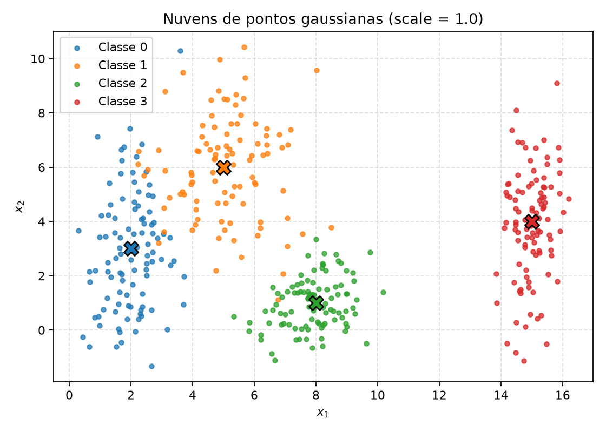
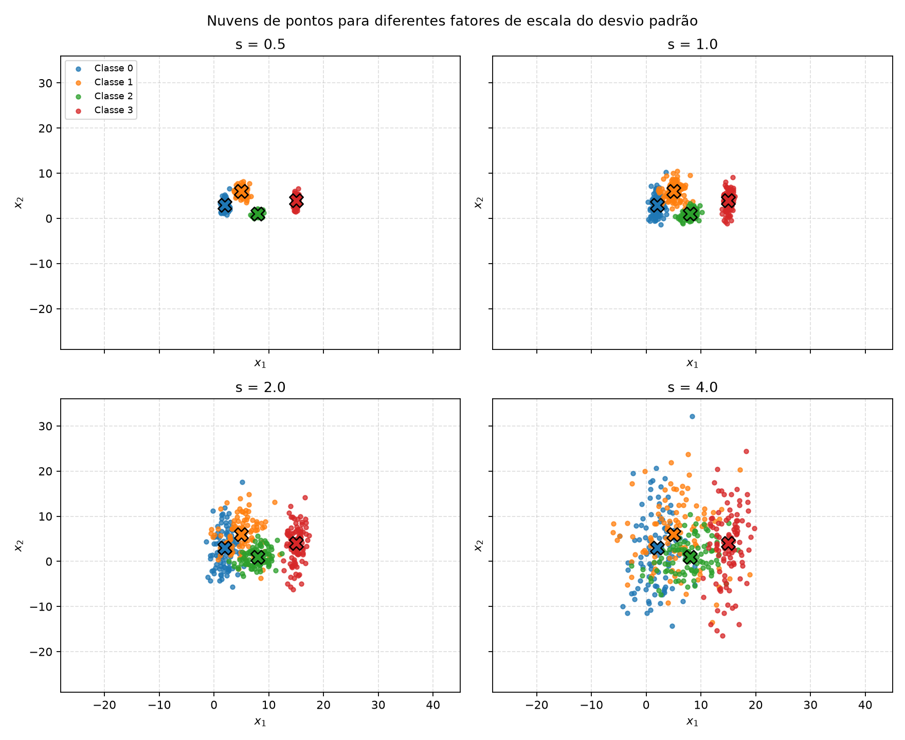
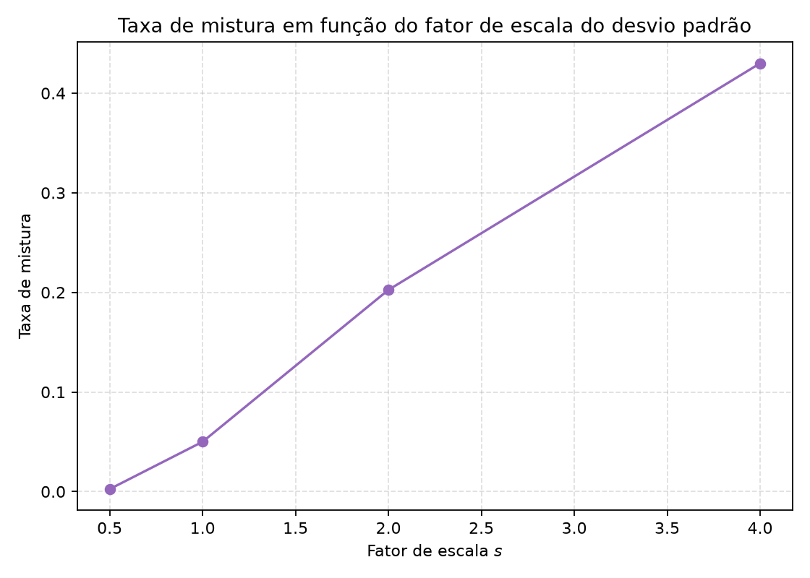
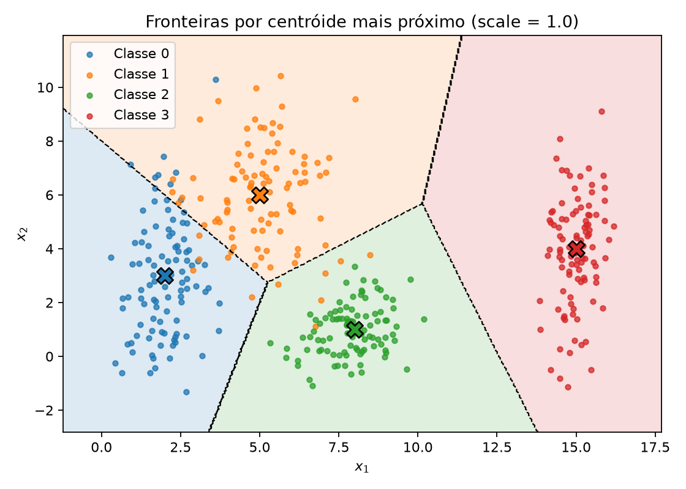
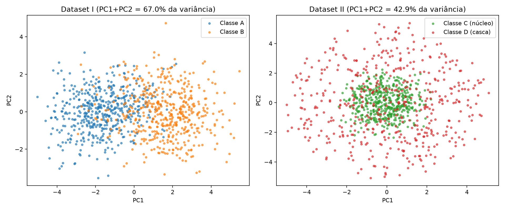
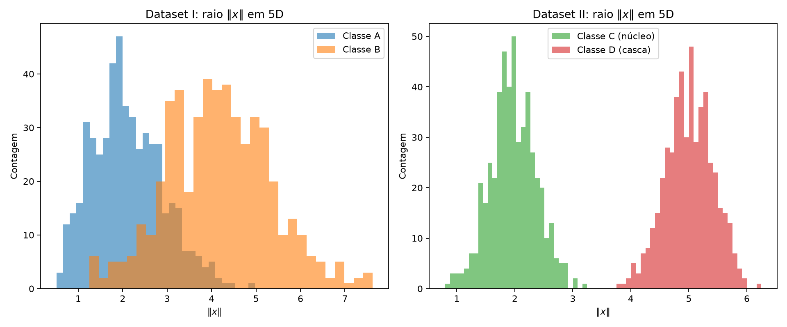
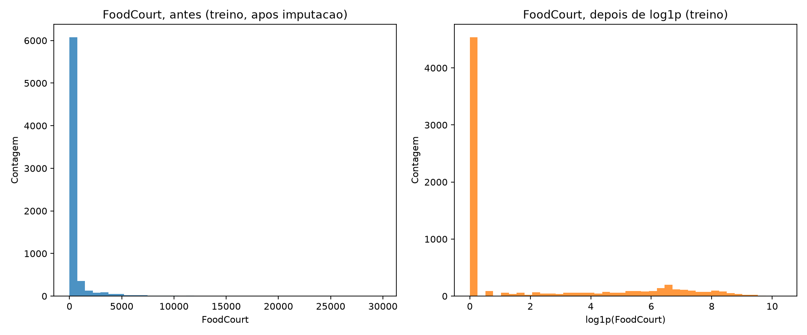

# 1. Data

!!! abstract "Enunciado"

    [Exercises → Data](https://insper.github.io/ann-dl/){:target='_blank'}

## Exercise 1

### Abordagem

O item A gera as 4 classes gaussianas em 2D com os parâmetros exatos do enunciado (médias e
desvios por classe), 100 pontos por classe, usando `rng = np.random.default_rng(42)`. Para o
item B, um único ruído padrão $N(0, I)$ é sorteado uma vez por classe e reaproveitado em
todas as escalas `s`, de forma que as quatro versões sejam literalmente as mesmas nuvens mais
ou menos espalhadas, e não sorteios independentes. A mesma instância `RNG` é usada do início ao
fim do script, o que garante que os números abaixo sejam reproduzíveis.

### Código

O script vive em [`code/exercise1_point_clouds.py`](https://github.com/usuario/ann-dl/blob/main/docs/exercises/data/code/exercise1_point_clouds.py)
e é incluído aqui pelo próprio arquivo.

``` { .python .copy .select linenums='1' title="docs/exercises/data/code/exercise1_point_clouds.py" }
--8<-- "docs/exercises/data/code/exercise1_point_clouds.py"
```

1.  Semente fixa, criada uma única vez e reutilizada em todo o script: sem ela, os números da
    tabela de resultados mudam a cada execução e a correção não consegue reproduzir o
    relatório.
2.  `plt.close(fig)` evita o vazamento de figuras quando o script gera várias em sequência.

### A: Generate the clouds


/// caption
**Figura 1.** Dispersão das quatro classes no plano $(x_1, x_2)$ com `scale = 1.0`; os `X`
marcam os centros (médias) de cada classe.
///

### B: More or less spread out


/// caption
**Figura 2.** As mesmas quatro nuvens com os desvios padrão multiplicados por
$s \in \{0.5, 1.0, 2.0, 4.0\}$, em eixos compartilhados.
///

A razão de separação $r_{ij} = \|\mu_i - \mu_j\| / (\bar\sigma_i + \bar\sigma_j)$, com
$\bar\sigma_k = (\sigma_{k,x} + \sigma_{k,y})/2$, calculada a partir dos parâmetros do
enunciado em `s = 1.0`, para os 6 pares de classes:

| Par $(i, j)$ | $r_{ij}$ |
|---|---|
| (0, 1) | 1.3258 |
| (0, 2) | 2.4802 |
| (0, 3) | 4.4960 |
| (1, 2) | 2.3800 |
| (1, 3) | 3.6422 |
| (2, 3) | 3.5422 |

O menor valor é $r_{01} = 1.3258$ (classes 0 e 1, os "vizinhos" mais próximos no plano). Como
apenas o denominador escala com `s` (as médias não mudam), $r_{ij}(s) = r_{ij}(1)/s$: sem
regenerar os dados, $r_{01}(2) = 1.3258 / 2 = 0.6629$.

A taxa de mistura (fração de pontos cujo centro de classe mais próximo não é o da própria
classe) para cada escala:

| $s$ | Taxa de mistura |
|---|---|
| 0.5 | 0.25% |
| 1.0 | 5.00% |
| 2.0 | 20.25% |
| 4.0 | 43.00% |


/// caption
**Figura 3.** Taxa de mistura × fator de escala $s$.
///

A taxa de mistura cresce de forma aproximadamente linear-acelerada com `s`: ela mais que
quadruplica entre `s = 1.0` e `s = 2.0` (de 5.00% para 20.25%) e volta a mais que dobrar até
`s = 4.0` (43.00%). Esse salto entre `s = 1.0` e `s = 2.0` coincide com o ponto em que o menor
$r_{ij}$ cruza 1: $r_{01}(1) = 1.33 > 1$ (centros ainda mais afastados que a dispersão média
somada), mas $r_{01}(2) = 0.66 < 1$ (dispersão já maior que a distância entre centros). É
razoável apontar `s = 2.0` como o fator em que a separação linear deixa de ser confiável para
o par (0, 1): com quase 1 em cada 5 pontos mais perto do centro errado, nenhuma fronteira
linear única consegue mais isolar as duas classes sem um erro substancial.

### C: Analysis


/// caption
**Figura 1 (variante).** Regiões de centróide mais próximo (fronteiras lineares por partes)
sobrepostas à Figura 1, como esboço do que uma rede treinada tenderia a aprender.
///

1.  Em `s = 1.0`, as classes 2 e 3 estão bem isoladas ($r_{02}, r_{03}, r_{12}, r_{13}, r_{23}$
    todos acima de 2.3), mas as classes 0 e 1 se tocam na região central ($r_{01} = 1.33$,
    taxa de mistura de 5.00%). Um único separador linear não pode isolar as 4 classes, pois uma
    reta divide o plano em apenas 2 regiões e há 4 classes; mas **múltiplos** separadores
    lineares (uma fronteira por par de classes vizinhas) conseguem uma separação quase
    completa, com um pequeno erro residual justamente entre as classes 0 e 1.
2.  A Figura 1 (variante) mostra o esboço: as fronteiras são os segmentos que dividem o plano
    em 4 regiões convexas, aproximadamente as bissetrizes perpendiculares entre cada par de
    centros vizinhos (0-1, 1-2, 1-3 e 2-3). É exatamente esse tipo de fronteira linear por
    partes que uma rede rasa treinada nesses dados tende a aproximar.
3.  Conforme as nuvens se espalham (item B), a região de sobreposição ao redor de cada
    fronteira cresce, e é nela que a rede é forçada a errar: a taxa de mistura sobe de 0.25%
    em `s = 0.5` para 43.00% em `s = 4.0`. Isso reflete um erro de Bayes crescente, que não é
    mais uma limitação do classificador, mas da própria distribuição dos dados, que passam a se
    sobrepor de verdade.

## Exercise 2

### Abordagem

O Dataset I usa `rng.multivariate_normal` com as médias e as matrizes de covariância 5×5 do
enunciado, 500 amostras por classe. O Dataset II sorteia direções uniformes na esfera unitária
de $\mathbb{R}^5$ (vetor gaussiano padrão normalizado) e um raio gaussiano por classe (núcleo
$\rho \sim N(2.0, 0.4)$, casca $\rho \sim N(5.0, 0.4)$, interpretando 0.4 como desvio padrão).
PCA (scikit-learn, só para projeção e variância explicada) reduz cada dataset a 2D
exclusivamente para visualização; nenhum modelo é treinado. A mesma semente 42 é reaproveitada
do início ao fim do script.

### Código

O script vive em [`code/exercise2_high_dim.py`](https://github.com/usuario/ann-dl/blob/main/docs/exercises/data/code/exercise2_high_dim.py)
e é incluído aqui pelo próprio arquivo.

``` { .python .copy .select linenums='1' title="docs/exercises/data/code/exercise2_high_dim.py" }
--8<-- "docs/exercises/data/code/exercise2_high_dim.py"
```

1.  Mesma semente única do Exercício 1, reaproveitada em todo o script.
2.  Limiar da função de separação proposta no item D3: o ponto médio entre os raios das duas
    classes ($(2.0 + 5.0)/2 = 3.5$), elevado ao quadrado porque a função testada é
    $\|x\|^2$, não $\|x\|$.

### A: Dataset I: shifted Gaussians

Classes A ($\mu_A = [0,0,0,0,0]$) e B ($\mu_B = [1.5,1.5,1.5,1.5,1.5]$), 500 amostras cada,
com as matrizes de covariância do enunciado (B com variâncias maiores e correlação negativa no
primeiro par de features, A com correlação positiva).

### B: Dataset II: concentric shells

Classes C (núcleo, $\rho \sim N(2.0, 0.4)$) e D (casca, $\rho \sim N(5.0, 0.4)$), 500 amostras
cada, construídas como $x = \rho \cdot u$ com $u$ uma direção uniforme na esfera unitária de
$\mathbb{R}^5$.

### C: Visualize and compare


/// caption
**Figura 4.** Projeção PCA (2 componentes) do Dataset I e do Dataset II, coloridas por
classe.
///

A variância explicada pelos dois primeiros componentes principais:

| Dataset | PC1 | PC2 | PC1 + PC2 |
|---|---|---|---|
| I (gaussianas deslocadas) | 51.27% | 15.77% | 67.04% |
| II (cascas concêntricas) | 21.59% | 21.32% | 42.91% |

A projeção do Dataset I preserva muito mais informação relevante para a classificação: as duas
classes já aparecem visualmente bem separadas ao longo de PC1 na Figura 4, e os dois
componentes juntos capturam 67.04% da variância total. No Dataset II, PC1+PC2 capturam apenas
42.91% da variância e as classes ficam completamente misturadas na projeção; como veremos no
item D, isso é uma limitação da projeção linear, não da separabilidade real dos dados.

Distância entre os centros de classe, calculada em $\mathbb{R}^5$ (sem passar por PCA):

- Dataset I: $\|\mu_A - \mu_B\| = 3.2643$
- Dataset II: $\|\mu_C - \mu_D\| = 0.2662$


/// caption
**Figura 5.** Histograma de $\|x\|$ em $\mathbb{R}^5$, classes sobrepostas, um painel por
dataset.
///

### D: Analysis

1.  No Dataset II os centros estão quase no mesmo ponto (distância de apenas 0.2662), mas os
    histogramas de raio são bem separados (núcleo com raio médio 1.9718, casca com raio médio
    5.0047, praticamente sem sobreposição na Figura 5). Isso mostra que a diferença entre as
    classes não está em *onde* a nuvem está centrada, mas na sua estrutura radial: exatamente
    o tipo de padrão que um hiperplano não consegue capturar, já que um hiperplano separa o
    espaço com base numa combinação linear das coordenadas, e não com base na distância a um
    centro comum.
2.  As duas classes são cascas esféricas concêntricas em torno da mesma origem aproximada. Por
    simetria, qualquer hiperplano $w^\top x + b = 0$ corta as duas cascas em pontos de ambas as
    classes em praticamente todas as direções, e não existe um lado do hiperplano que fique
    predominantemente com uma classe. Mais dados não mudam essa geometria: eles apenas
    descrevem com mais precisão a mesma distribuição sobreposta em qualquer projeção linear, o
    problema é estrutural, não estatístico.
3.  Não. PCA é uma transformação linear, então uma projeção 2D misturada só prova que as duas
    direções de maior variância não coincidem com a direção que separa as classes, não que as
    classes sejam inseparáveis no espaço original. A evidência está nos próprios
    resultados: mesmo com a Figura 4 mostrando as classes completamente sobrepostas
    (PC1+PC2 = 42.91% da variância), a função simples
    $$
    f(\mathbf{x}) = \|\mathbf{x}\|^2 = \sum_i x_i^2,
    $$
    com limiar $((2.0 + 5.0)/2)^2 = 12.25$, separa as duas classes do Dataset II com 100.00% de
    acurácia (script `exercise2_high_dim.py`, item D3): uma função não linear das coordenadas
    originais resolve exatamente o que a projeção linear escondia.

## Exercise 3

### Abordagem

O `train.csv` do Spaceship Titanic (baixado manualmente do Kaggle) é dividido 80/20 de forma
estratificada com semente fixa **antes** de qualquer imputação, codificação ou escalonamento.
Os transformadores (mediana, moda, one-hot, `MinMaxScaler`) são ajustados exclusivamente no
conjunto de treino e depois aplicados ao teste, para que nenhuma estatística do teste vaze para
o pré-processamento.

### Código

O script vive em [`code/exercise3_spaceship_titanic.py`](https://github.com/usuario/ann-dl/blob/main/docs/exercises/data/code/exercise3_spaceship_titanic.py)
e é incluído aqui pelo próprio arquivo. Ele espera o dataset em
`docs/exercises/data/code/data/train.csv` (não versionado, veja `.gitignore`).

``` { .python .copy .select linenums='1' title="docs/exercises/data/code/exercise3_spaceship_titanic.py" }
--8<-- "docs/exercises/data/code/exercise3_spaceship_titanic.py"
```

1.  O split estratificado com semente fixa acontece antes de qualquer `fit` de imputador,
    codificador ou escalador: é o que evita vazamento de dados do teste para o treino.
2.  `plt.close(fig)` evita o vazamento de figuras quando o script gera várias em sequência.

### A: Get to know the data

O dataset descreve passageiros de uma nave interestelar que colidiu com uma anomalia
espaço-temporal; a coluna `Transported` indica se o passageiro foi transportado para uma
dimensão alternativa (`True`) ou não (`False`). O balanço de classes é quase perfeito: 50.36%
`True` e 49.64% `False`, num total de 8693 passageiros.

Features numéricas: `Age`, `RoomService`, `FoodCourt`, `ShoppingMall`, `Spa`, `VRDeck`.
Features categóricas: `HomePlanet`, `CryoSleep`, `Destination`, `VIP` (mais `Cabin`, que é uma
string composta e é descartada no item C3 junto com `Name` e `PassengerId`, ambos
identificadores sem valor preditivo).

Valores ausentes por coluna (das 14 colunas originais, 12 têm algum valor ausente; só
`PassengerId` e `Transported` estão sempre preenchidas):

| Coluna | Ausentes | % |
|---|---|---|
| HomePlanet | 201 | 2.31% |
| CryoSleep | 217 | 2.50% |
| Cabin | 199 | 2.29% |
| Destination | 182 | 2.09% |
| Age | 179 | 2.06% |
| VIP | 203 | 2.34% |
| RoomService | 181 | 2.08% |
| FoodCourt | 183 | 2.11% |
| ShoppingMall | 208 | 2.39% |
| Spa | 183 | 2.11% |
| VRDeck | 188 | 2.16% |
| Name | 200 | 2.30% |

Estatísticas das 5 colunas de gasto, nos dados brutos (antes do split):

| Coluna | Média | Mediana | Máximo |
|---|---|---|---|
| RoomService | 224.69 | 0.00 | 14327.00 |
| FoodCourt | 458.08 | 0.00 | 29813.00 |
| ShoppingMall | 173.73 | 0.00 | 23492.00 |
| Spa | 311.14 | 0.00 | 22408.00 |
| VRDeck | 304.85 | 0.00 | 24133.00 |

A mediana é 0 em todas as 5 colunas, enquanto a média fica na casa das centenas: a maioria
dos passageiros não gasta nada em nenhuma categoria, e uma minoria gasta muito (o máximo chega
a quase 30 mil em `FoodCourt`), puxando a média para cima. Essa diferença grande entre média e
mediana é a assinatura de uma distribuição fortemente assimétrica à direita (cauda pesada), o
que motiva a transformação logarítmica do item C4.

### B: Split before you transform

`train_test_split` com `test_size=0.2`, `stratify=Transported` e `random_state=42`, aplicado
**antes** de qualquer imputação, encoding ou escalonamento: 6954 amostras de treino e 1739 de
teste.

O split precisa vir antes de qualquer transformação porque imputadores, codificadores e
escaladores aprendem estatísticas dos dados (mediana, moda, mínimo/máximo) que, se calculadas
sobre o conjunto inteiro, vazariam informação do teste para o treino. Isso infla artificialmente
o desempenho medido no teste, porque o modelo estaria sendo avaliado em dados cujas estatísticas
ele já "viu" de alguma forma durante o pré-processamento.

### C: Preprocess

**Dados ausentes (C1):** colunas numéricas recebem imputação pela **mediana**, ajustada só no
treino, mais robusta que a média diante da cauda pesada já observada em A. Colunas
categóricas recebem imputação pela **moda** (categoria mais frequente), também ajustada só no
treino; como a proporção de ausentes é pequena (~2% em cada coluna) e não há indício de um
padrão sistemático de ausência, a moda é uma escolha simples e adequada.

**Features categóricas (C2):** `HomePlanet`, `CryoSleep`, `Destination` e `VIP` são
codificadas com `OneHotEncoder(handle_unknown="ignore")`, ajustado só no treino. Categorias do
teste que não aparecem no treino (nenhuma ocorreu neste split, mas o mecanismo cobre o caso)
são codificadas como uma linha de zeros em todas as colunas *dummy* daquela feature, em vez de
gerar erro ou uma coluna nova.

**Feature engineering (C3):** `TotalSpend` é criada como a soma das 5 colunas de gasto;
`Cabin`, `Name` e `PassengerId` são descartadas (identificadores ou texto composto sem valor
preditivo direto).

**Cauda pesada (C4):** `log1p` é aplicado às 5 colunas de gasto e a `TotalSpend`.


/// caption
**Figura 6.** Histograma de `FoodCourt` no treino, antes (bruto, após imputação) e depois de
`log1p`.
///

`tanh` satura (gradiente perto de zero) para entradas de magnitude grande; com valores brutos
chegando a dezenas de milhares, a soma ponderada de entrada da rede ficaria na região saturada
da `tanh` para a maioria das unidades. `log1p` comprime essa cauda longa para uma faixa muito
mais estreita (a Figura 6 mostra o eixo indo de ~30000 para ~10), mantendo mais da distribuição
na região sensível da ativação.

**Escalonamento (C5):** `MinMaxScaler(feature_range=(-1, 1))`, ajustado só no treino, aplicado
às colunas numéricas (`Age`, as 5 colunas de gasto já transformadas por `log1p`, e
`TotalSpend`). A escolha por `[-1, 1]` em vez de padronização (média 0, desvio 1) casa
diretamente com a imagem de saída da `tanh`. Como o escalador é ajustado só no treino, o
próprio treino fica exatamente em `[-1.0000, 1.0000]` por construção, enquanto o teste fica em
`[-1.0000, 1.1383]`. O valor acima de 1 é esperado, não um erro: existe pelo menos um valor no
teste maior que o máximo visto no treino para alguma feature, e é exatamente esse tipo de
diferença que o split antes do escalonamento deve preservar.

### D: Verify and visualize

Figura 6 apresentada no item C4 acima.

Verificações finais:

- NaN restantes: 0 no treino e 0 no teste.
- Formato final da matriz de treino: `(6954, 17)`; da matriz de teste: `(1739, 17)`.
- Faixa de valores: treino em `[-1.0000, 1.0000]` (dentro da imagem de `tanh` por construção);
  teste em `[-1.0000, 1.1383]` (compatível na prática, já que `tanh` continua suave e
  bem-comportada para entradas ligeiramente acima de 1).

A decisão de pré-processamento com maior efeito no treinamento é a transformação `log1p` das
colunas de gasto. Sem ela, a razão entre o máximo e a mediana chega à casa dos milhares (ex.:
`FoodCourt`, máximo 29813 contra mediana 0), e o `MinMaxScaler` comprimiria a enorme maioria
dos passageiros que gastam pouco ou nada para um intervalo minúsculo colado em `-1`, jogando os
poucos grandes gastadores para a região saturada da `tanh` e destruindo a capacidade da rede de
distinguir níveis intermediários de gasto. A imputação e o one-hot, em comparação, afetam uma
fração pequena das linhas ou têm efeito mais localizado.

## Results summary

| # | Item | Valor |
|---|------|-------|
| 1 | Taxa de mistura em s = 0.5 | 0.25% |
| 2 | Taxa de mistura em s = 1.0 | 5.00% |
| 3 | Taxa de mistura em s = 2.0 | 20.25% |
| 4 | Taxa de mistura em s = 4.0 | 43.00% |
| 5 | Menor $r_{ij}$ em s = 1.0, e qual par | 1.3258 (par 0-1) |
| 6 | Distância entre centros (Dataset I) | 3.2643 |
| 7 | Distância entre centros (Dataset II) | 0.2662 |
| 8 | Variância explicada PC1 + PC2 (Dataset I) | 67.04% |
| 9 | Variância explicada PC1 + PC2 (Dataset II) | 42.91% |
| 10 | Proporção da classe positiva em Transported | 50.36% |
| 11 | Média e mediana de FoodCourt no treino, antes de transformar | média 442.59 / mediana 0.00 |
| 12 | Formato final da matriz de treino | (6954, 17) |
| 13 | Mínimo e máximo dos conjuntos de treino e teste após o escalonamento | treino [-1.0000, 1.0000]; teste [-1.0000, 1.1383] |

## Discussão

Um ponto que exigiu cuidado foi o
item B do Exercício 1: sortear as quatro escalas de forma independente contaminaria a
comparação entre elas com ruído extra, então reaproveitei o mesmo ruído-base nas quatro. Na
análise do Dataset II, com os centros quase
coincidentes eu esperava dados misturados, mas o histograma do raio mostra que qualquer
hiperplano corta as duas cascas de forma parecida, não importa a orientação. Se fosse refazer,
tentaria reportar uma faixa em vez de um número único para a taxa de mistura, já que com 400
pontos por rodada esse valor deve variar de seed para seed.

## Conclusão

Os três exercícios mostram a mesma ideia sob ângulos diferentes: a complexidade da fronteira
que uma rede precisa aprender é ditada pela geometria da distribuição dos dados, não por uma
escolha de arquitetura. No Exercício 1, uma métrica simples baseada nas médias e desvios
($r_{ij}$) já prevê quando a separação linear degrada, e a taxa de mistura torna esse limite
mensurável. No Exercício 2, o Dataset II é o contraponto: duas classes com centros quase
idênticos, perfeitamente separáveis por uma função não linear das coordenadas, mas invisíveis
para qualquer hiperplano ou projeção linear, e nenhuma quantidade de dados lineares resolveria
isso, só uma mudança na forma da fronteira. O Exercício 3 mostra o mesmo princípio do lado do
pré-processamento: a escala e a forma da distribuição de entrada (cauda pesada das colunas de
gasto) interagem diretamente com a região de operação da função de ativação, então preparar os
dados é, na prática, parte de preparar a rede para conseguir aprender a fronteira certa.
