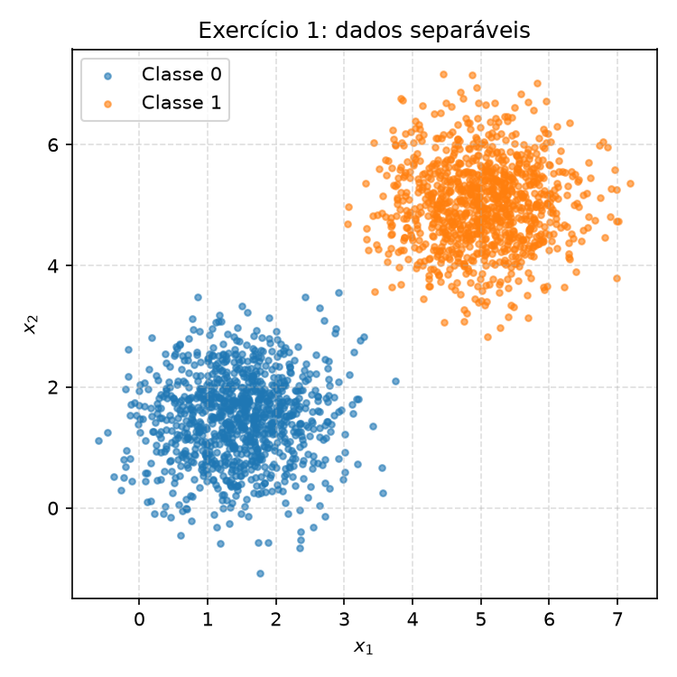
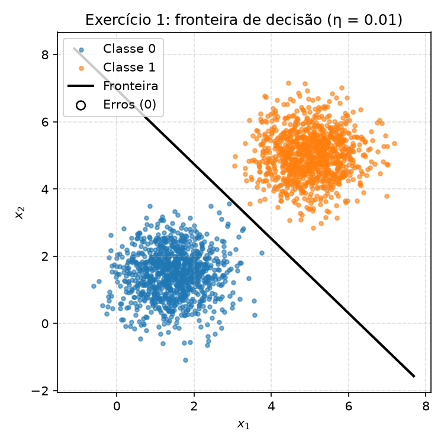
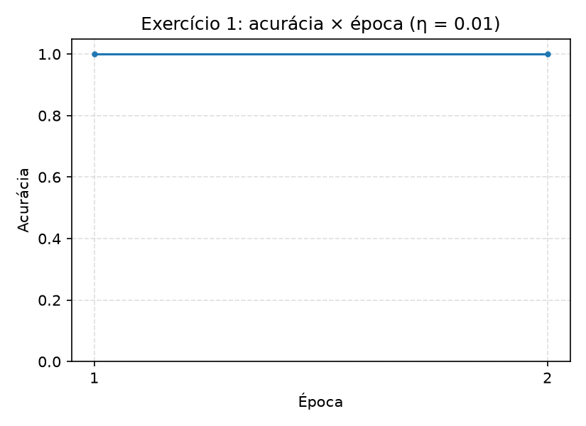
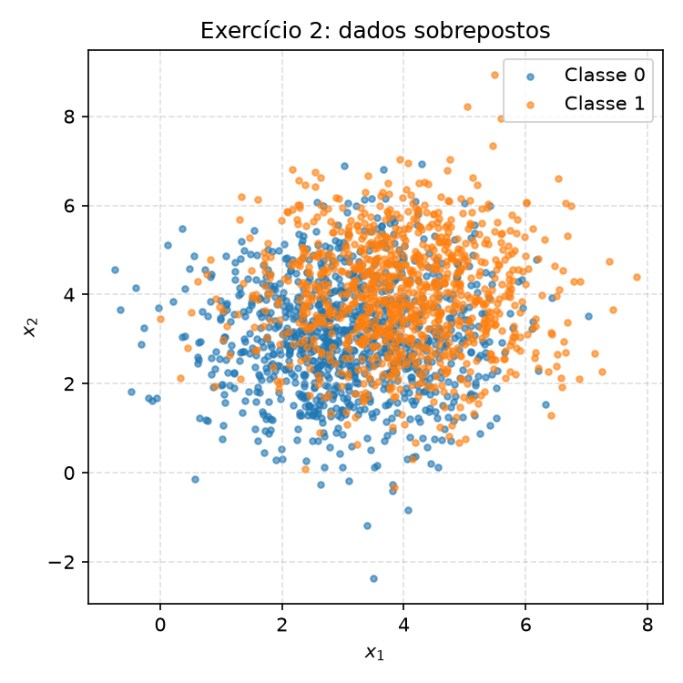
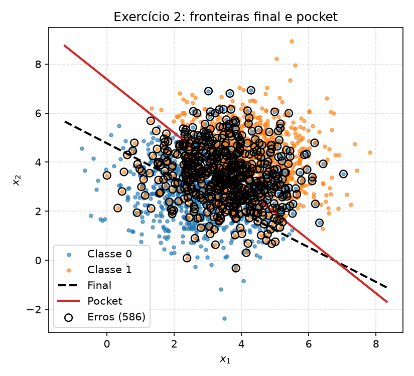
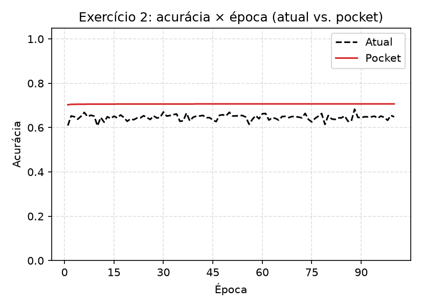

# 2. Perceptron

!!! abstract "Enunciado"

    [Exercises → Perceptron](https://insper.github.io/ann-dl/){:target='_blank'}

## Exercise 1

### Abordagem

O perceptron (predição, regra de atualização e loop de treino) é escrito do zero e usado sem
nenhuma alteração no Exercício 2. Os dois datasets são gerados com `rng.multivariate_normal` e
embaralhados uma única vez, de forma que a ordem das 2000 amostras fique fixa em todas as
épocas de uma mesma chamada de treino, condição necessária para que "re-rodar com η = 1.0,
mudando nada mais" (item D) seja uma comparação exata. A mesma instância
`rng = np.random.default_rng(42)` é criada uma única vez e reutilizada do início ao fim do
script, inclusive na geração do dataset do Exercício 2.

### Código

O script vive em [`code/perceptron.py`](https://github.com/lucacm/ann-dl-2026-2/blob/main/docs/exercises/perceptron/code/perceptron.py)
e é incluído aqui pelo próprio arquivo, por trecho.

### A: Generate the data

``` { .python .copy .select linenums='1' title="docs/exercises/perceptron/code/perceptron.py" }
--8<-- "docs/exercises/perceptron/code/perceptron.py:setup"

--8<-- "docs/exercises/perceptron/code/perceptron.py:data"
```

1.  Semente única, criada uma vez e reaproveitada em todo o script (Exercícios 1 e 2):
    sem ela os números da tabela de resultados mudam a cada execução.


/// caption
**Figura 1.** Dispersão das duas classes gaussianas do Exercício 1 (1000 pontos cada).
///

### B: Implement the perceptron

``` { .python .copy .select linenums='1' title="docs/exercises/perceptron/code/perceptron.py" }
--8<-- "docs/exercises/perceptron/code/perceptron.py:perceptron"
```

A regra usada é a do enunciado para rótulos em $\{0,1\}$:
$\mathbf{w} \leftarrow \mathbf{w} + \eta(y - \hat y)\mathbf{x}$ e
$b \leftarrow b + \eta(y - \hat y)$, com $\hat y = \text{step}(\mathbf{w}\cdot\mathbf{x}+b)$.
Não a forma $\mathbf{w} \leftarrow \mathbf{w} + \eta y \mathbf{x}$ comum em livros-texto: essa
versão pertence à convenção de rótulos $\{-1,+1\}$, e com rótulos $\{0,1\}$ nunca atualizaria
para a Classe 0 ($y=0$ anula o termo $\eta y \mathbf{x}$), tornando impossível corrigir um
falso positivo. O erro $(y-\hat y)$ já é $0$ em toda predição correta, e $\pm 1$ nos dois tipos
de erro, o que faz a atualização acontecer só quando necessário.

Os pesos iniciais vêm de `rng.normal(0, 0.01, size=2)` e $b=0$, nunca de $\mathbf{w}=\mathbf{0}$:
o item D usa exatamente esse contraste para mostrar que, partindo de zero, $\eta$ não teria
nenhum efeito.

### C: Train and measure

``` { .python .copy .select linenums='1' title="docs/exercises/perceptron/code/perceptron.py" }
--8<-- "docs/exercises/perceptron/code/perceptron.py:ex1"
```

Com $\eta = 0.01$ e o ponto inicial $\mathbf{w}_0 = [0.0099, -0.0083]$, $b_0=0$: convergência em
**2 épocas** (48 atualizações na primeira, 0 na segunda), pesos finais
$\mathbf{w} = [0.0319, 0.0287]$, $b = -0.2000$, acurácia final **100.00%**.


/// caption
**Figura 2.** Fronteira de decisão $\mathbf{w}\cdot\mathbf{x}+b=0$ (η = 0.01) sobre os dados;
não há pontos mal classificados.
///


/// caption
**Figura 3.** Acurácia × época (η = 0.01).
///

### D: Analysis

1.  **Por que a convergência é rápida.** As duas médias, $[1.5,1.5]$ e $[5,5]$, estão muito
    afastadas frente ao desvio padrão $\sqrt{0.5}\approx 0.71$ de cada classe, então a margem de
    separação entre as nuvens é grande e poucos pontos ficam perto da fronteira ótima. Isso se
    reflete diretamente na contagem de atualizações por época: 48 na primeira época e **0** na
    segunda. A regra só atualiza em erro, então, à medida que a fronteira gira na direção certa,
    a fração de pontos do lado errado cai rapidamente; com margem grande essa fração chega a
    zero de uma só vez (não gradualmente ao longo de várias épocas), e a próxima passagem
    completa sem nenhuma atualização é exatamente o critério de parada.
2.  **Efeito de $\eta = 1.0$.** Com os mesmos dados e o mesmo $\mathbf{w}_0$, a corrida com
    $\eta=1.0$ também converge em **2 épocas** (25 atualizações na primeira, 0 na segunda) e
    atinge **100.00%** de acurácia, com pesos finais $\mathbf{w}=[1.7173, 1.6646]$,
    $b=-11.0000$. As duas corridas terminam em 100% mas com fronteiras diferentes: a direção
    $\mathbf{w}/\lVert\mathbf{w}\rVert$ é $[0.7429, 0.6694]$ para $\eta=0.01$ e
    $[0.7181, 0.6960]$ para $\eta=1.0$, um ângulo de **2.0851°** entre elas. Isso é o que se
    espera de $\eta$: ele controla o tamanho do passo, ou seja, o quanto cada atualização move
    $\mathbf{w}$ em relação à sua magnitude atual. Os pesos iniciais têm magnitude
    $\approx 0.01$; com $\eta=0.01$ cada atualização soma um termo $\eta\mathbf{x}$ de magnitude
    comparável a esse ponto de partida (algumas unidades de $x$ vezes $0.01$), então o ruído da
    inicialização ainda deixa uma marca perceptível na direção final. Com $\eta=1.0$, cada
    atualização soma um termo cem vezes maior, que domina o ponto de partida quase de imediato,
    o que também explica por que essa corrida precisou de menos atualizações (25 contra 48) para
    convergir: passos maiores corrigem o mesmo erro angular com menos iterações.
3.  **Por que $\mathbf{w}=\mathbf{0}$, $b=0$ tornaria $\eta$ irrelevante.** Seja $s$ o índice de
    uma amostra processada (contando amostra a amostra, ao longo de todas as épocas), e suponha,
    por indução, que em algum passo $s$, para todo $\eta>0$, vale
    $\mathbf{w}_s(\eta) = \eta\,\mathbf{u}_s$ e $b_s(\eta) = \eta\,c_s$,
    com $\mathbf{u}_s$ e $c_s$ **independentes de $\eta$**. Isso vale trivialmente em $s=0$
    (ambos nulos). No passo $s$, a predição usa
    $z_s = \mathbf{w}_s\cdot\mathbf{x}_s + b_s = \eta\,(\mathbf{u}_s\cdot\mathbf{x}_s + c_s)$;
    como $\eta>0$, o sinal de $z_s$ (e portanto $\hat y_s = \text{step}(z_s)$) é o mesmo sinal de
    $\mathbf{u}_s\cdot\mathbf{x}_s+c_s$, **não depende de $\eta$**. Logo o erro
    $e_s = y_s-\hat y_s$ é idêntico para qualquer $\eta>0$: a sequência inteira de acertos e
    erros é a mesma, não importa o $\eta$. Se $e_s=0$ nada muda; se $e_s\neq0$,
    $\mathbf{w}_{s+1}=\eta(\mathbf{u}_s+e_s\mathbf{x}_s)$ e $b_{s+1}=\eta(c_s+e_s)$, ou seja
    $\mathbf{u}_{s+1}=\mathbf{u}_s+e_s\mathbf{x}_s$ e $c_{s+1}=c_s+e_s$, novamente sem depender
    de $\eta$. Por indução a propriedade vale em todo passo $s$, com a **mesma** sequência
    $\{\mathbf{u}_s\}, \{c_s\}, \{e_s\}$ para qualquer $\eta$. Duas consequências: (i) o número
    de atualizações por época, e portanto o número total de épocas $E$ até convergir, é idêntico
    para quaisquer $\eta_1,\eta_2>0$; (ii) ao final, $\mathbf{w}(\eta)=\eta\,\mathbf{u}_E$ e
    $b(\eta)=\eta\,c_E$, logo $\mathbf{w}(\eta_2) = \frac{\eta_2}{\eta_1}\,\mathbf{w}(\eta_1)$ e
    $b(\eta_2) = \frac{\eta_2}{\eta_1}\,b(\eta_1)$.
    Como a fronteira de decisão é o conjunto $\{\mathbf{x} : \mathbf{w}\cdot\mathbf{x}+b=0\}$ e
    multiplicar $(\mathbf{w},b)$ por uma constante positiva não muda esse conjunto, a fronteira
    aprendida (e o número de épocas) seria exatamente a mesma para qualquer $\eta>0$: $\eta$ só
    reescalaria o vetor de pesos, sem nenhum efeito real. É exatamente isso que o item B evita ao
    proibir a inicialização em zero. A verificação numérica confirma a prova: partindo de
    $\mathbf{w}=\mathbf{0}$, $b=0$, as corridas com $\eta_1=0.01$ e $\eta_2=1.00$ convergem nas
    **mesmas 2 épocas**, com $\mathbf{w}(\eta_2)/\mathbf{w}(\eta_1) = [100.0000, 100.0000]$ e
    $b(\eta_2)/b(\eta_1) = 100.0000$, exatamente $\eta_2/\eta_1 = 1.00/0.01 = 100$. (Note que,
    com o $\mathbf{w}_0\neq\mathbf{0}$ realmente usado no item C, essa proporcionalidade exata
    não vale, o que também explica por que as duas corridas de lá tiveram números diferentes de
    atualizações e terminaram em direções ligeiramente distintas.)

## Exercise 2

### Abordagem

O dataset do Exercício 2 é gerado com o mesmo `rng` (dando sequência ao Exercício 1) e as
médias e covariâncias do enunciado, agora muito mais próximas e espalhadas, de forma que as
nuvens se sobrepõem bastante. A implementação do perceptron é exatamente a mesma do Exercício
1 (função `train`); a única adição é o acompanhamento *pocket*: sempre que uma atualização
produz, no dataset inteiro, uma acurácia maior que a melhor já vista, os pesos correntes são
copiados para o "bolso".

### A: Generate the data

``` { .python .copy .select linenums='1' title="docs/exercises/perceptron/code/perceptron.py" }
--8<-- "docs/exercises/perceptron/code/perceptron.py:ex2"
```


/// caption
**Figura 4.** Dispersão das duas classes gaussianas do Exercício 2 (1000 pontos cada), com
sobreposição visível na região central.
///

### B: Train, keeping the best weights

A mesma função `train` do Exercício 1 (ver item B acima), chamada com `pocket=True`, $\eta=0.01$
e o mesmo teto de 100 épocas. Como os dados não são linearmente separáveis, o treino nunca para
sozinho: as 100 épocas rodam até o fim, com entre 739 e 822 atualizações por época (média 766.2),
sem tendência de queda.

| | $\mathbf{w}$ | $b$ | Acurácia |
|---|---|---|---|
| Pesos finais | $[0.0682,\ 0.0965]$ | $-0.4600$ | 64.85% |
| Pesos *pocket* | $[0.0709,\ 0.0650]$ | $-0.4800$ | 70.70% |

Os pesos *pocket* foram atingidos na época 40 e nunca mais superados nas 60 épocas seguintes.

### C: Figures


/// caption
**Figura 5.** Fronteiras final (tracejada) e *pocket* (sólida) sobre os dados; os círculos
marcam os pontos mal classificados pela fronteira *pocket*.
///


/// caption
**Figura 6.** Acurácia × época: pesos correntes (tracejada) contra a melhor acurácia *pocket*
já vista (sólida).
///

### D: Analysis

1.  **A diferença entre 64.85% (final) e 70.70% (pocket).** A cada erro, $b$ se move
    $\eta\cdot(\pm 1) = \pm 0.01$, enquanto $\mathbf{w}$ se move $\eta\,\mathbf{x}$, de magnitude
    $\eta\lVert\mathbf{x}\rVert \approx 0.01 \times 5 = 0.05$ para esses dados (os pontos ficam a
    uma distância da origem da ordem de 5, já que as médias são $[3,3]$ e $[4,4]$). Ou seja, a
    cada atualização $\mathbf{w}$ se move cerca de 5× mais que $b$. Como os dados não são
    separáveis, o par $(\mathbf{w},b)$ nunca converge para um ponto fixo: ele passa a vida toda
    dando um passeio ruidoso e sem parar pelo espaço de pesos (739 a 822 atualizações por época,
    das 100 primeiras às 100 últimas). Os pesos finais são simplesmente onde esse passeio estava
    no fim da época 100, um ponto qualquer da trajetória, sem nenhuma garantia de ser bom; a
    fronteira boa exige um equilíbrio específico entre $\mathbf{w}$ e $b$ (a posição do
    intercepto entre as duas nuvens), e como $b$ se move proporcionalmente menos que
    $\mathbf{w}$ a cada erro, esse equilíbrio é fácil de perder e difícil de manter. O algoritmo
    *pocket*, em vez de confiar no ponto final da caminhada, guarda o melhor ponto visitado em
    qualquer momento dela, o que explica por que fica muito mais perto do ótimo linear (~73%
    segundo o enunciado; aqui, 70.70%).
2.  **Figura 3 × Figura 6.** No Exercício 1 a curva de acurácia sobe e se estabiliza em 100% já
    na primeira época, porque a partir do momento em que todos os pontos ficam do lado certo,
    nenhuma amostra gera mais erro e $(\mathbf{w},b)$ para de se mover. Na Figura 6, a curva da
    acurácia atual nunca se estabiliza: ela oscila em torno de valores medianos ao longo de todas
    as 100 épocas, exatamente porque sempre existem centenas de pontos do lado errado da
    fronteira corrente (739 a 822 por época). O teorema de convergência do perceptron garante
    que, **se existir uma margem $\gamma>0$ que separe as duas classes perfeitamente**, o
    algoritmo converge (para de atualizar) em no máximo $(R/\gamma)^2$ atualizações, com $R$
    limitando a norma dos pontos. A hipótese que esse dataset quebra é justamente a existência de
    $\gamma>0$: as classes se sobrepõem, não existe nenhum hiperplano com erro zero, logo não há
    margem alguma e o teorema simplesmente não se aplica, não havendo motivo para a curva se
    estabilizar.
3.  **Mais épocas? $\eta$ menor?** Nenhum dos dois resolve. Mais épocas apenas repetem o mesmo
    padrão: a atualização só depende de haver, na amostra da vez, um erro de classificação, e
    como não existe fronteira linear com erro zero para estes dados, sempre haverá amostras do
    lado errado nas 100 primeiras épocas como nas próximas 100, sem motivo estrutural para o
    número de atualizações cair a zero. $\eta$ menor apenas encolhe o tamanho de cada passo do
    mesmo passeio sem destino: ele muda a escala do movimento, não o fato de que
    $(\mathbf{w},b)$ nunca alcança um ponto onde a atualização para de acontecer, porque essa
    parada depende só do sinal de $\mathbf{w}\cdot\mathbf{x}+b$ coincidir com $y$ em toda amostra
    simultaneamente, condição que a geometria sobreposta dos dados torna impossível para
    qualquer hiperplano, com qualquer $\eta$. O único jeito de obter uma fronteira boa aqui é o
    que o item B já faz: acompanhar o melhor ponto visitado (*pocket*), não esperar o passeio
    parar sozinho.

## Results summary

| # | Quantity | Value |
|---|----------|-------|
| 1 | Exercise 1, final $\mathbf{w}$ and $b$ | $\mathbf{w}=[0.0319,\ 0.0287]$, $b=-0.2000$ |
| 2 | Exercise 1, epochs to convergence | 2 |
| 3 | Exercise 1, final accuracy | 100.00% |
| 4 | Exercise 1, epochs and final accuracy with $\eta = 1.0$ | 2 épocas, 100.00% |
| 5 | Exercise 2, final $\mathbf{w}$ and $b$ | $\mathbf{w}=[0.0682,\ 0.0965]$, $b=-0.4600$ |
| 6 | Exercise 2, accuracy of the final weights | 64.85% |
| 7 | Exercise 2, accuracy of the pocket weights | 70.70% |
| 8 | Exercise 2, epoch at which the pocket best occurred | 40 |

## Discussão

O ponto que mais exigiu cuidado foi manter a mesma ordem de amostras em todas as épocas de uma
chamada de treino (embaralhar uma vez na geração dos dados, não a cada época): sem isso, a
comparação entre $\eta=0.01$ e $\eta=1.0$ do item D deixaria de ser justa, já que cada corrida
veria uma sequência diferente de erros. Outro ponto que valeu a pena verificar numericamente, e
não só argumentar algebricamente, foi a prova do item D3: rodar o treino a partir de
$\mathbf{w}=\mathbf{0}$ com dois valores de $\eta$ e conferir que a razão entre os pesos finais
bate exatamente com a razão entre os $\eta$ (100.0000 nos dois casos) deu bastante confiança na
prova. Uma limitação da entrega é que os números do Exercício 2 (64.85% final, 70.70% pocket)
vêm de uma única semente; com $\mathbf{w}_0$ sorteado de outra forma, a trajetória do passeio
aleatório de pesos seria outra e esses valores específicos mudariam, embora o padrão qualitativo
(gap grande entre final e pocket, nenhuma tendência de queda nas atualizações por época) deva se
manter.

## Conclusão

Os dois exercícios mostram os dois lados do mesmo algoritmo. No Exercício 1, com margem grande
entre as classes, o perceptron converge em poucas épocas e a escolha de $\eta$ não muda o
resultado final, só a rota até lá (e, a partir de pesos não nulos, também deixa uma marca sutil
na direção final, algo que a prova do item D3 mostra que desapareceria por completo com
inicialização em zero). No Exercício 2, sem margem nenhuma, o mesmo algoritmo, com a mesma
implementação, nunca converge, e a diferença entre a solução final e a solução *pocket* (64.85%
contra 70.70%) mostra que o problema não é da implementação, é da geometria dos dados: nenhuma
quantidade de épocas ou ajuste de $\eta$ substitui a garantia que só existe quando há uma margem
$\gamma>0$ separando as classes, e é exatamente aí que o teorema de convergência deixa de valer.
