# 1. EDA: Análise Exploratória

!!! abstract "Entrega 1 de 3 do [Projeto](../index.md)"

    [Projects → EDA](https://insper.github.io/ann-dl/){:target='_blank'}

!!! info "Equipe"

    | Nome completo | GitHub |
    |---------------|--------|
    | Luca Cazzolato Machado | [@lucacm](https://github.com/lucacm) |
    | | |
    | | |

    Dataset, decisões e status: [página do projeto](../index.md).

!!! example "Como reproduzir"

    Os CSVs não são versionados. Para rodar a análise a partir de um clone:

    1. Baixe o dataset [Vehicle dataset (CarDekho)](https://www.kaggle.com/datasets/nehalbirla/vehicle-dataset-from-cardekho){:target='_blank'}
       no Kaggle e descompacte os **4 arquivos `.csv`** em `docs/projects/eda/code/data/`.
    2. Instale as dependências: `python3 -m pip install -r requirements.txt`.
    3. Na raiz do repositório, rode `python docs/projects/eda/code/eda.py`.

    O script regenera as 16 figuras em `figures/` e imprime todos os números citados nesta
    página, na ordem das seções. Toda aleatoriedade usa `random_state=42`
    (`SEED` em [`cardekho.py`](https://github.com/lucacm/ann-dl-2026-2/blob/main/docs/projects/eda/code/cardekho.py)),
    então duas execuções produzem os mesmos números.

O código está dividido em dois arquivos:

- [`code/cardekho.py`](https://github.com/lucacm/ann-dl-2026-2/blob/main/docs/projects/eda/code/cardekho.py)
  é o **módulo importável**: leitura, deduplicação, harmonização, split e o pipeline. As
  entregas seguintes importam daqui.
- [`code/eda.py`](https://github.com/lucacm/ann-dl-2026-2/blob/main/docs/projects/eda/code/eda.py)
  gera as figuras e os números deste relatório.

**Tarefa:** regressão do preço de venda (`price`, em rúpias) de carros usados anunciados no
site indiano CarDekho, a partir das características do carro.

## 1. Inspeção inicial

### 1A. Dicionário de dados

#### Seleção das fontes

O Kaggle publica **quatro arquivos** sob o mesmo nome. Eles não são versões complementares
de uma mesma tabela: são raspagens diferentes do site, com colunas, tamanhos e populações
diferentes. Antes de definir o dataset, os quatro foram comparados com os mesmos critérios.

``` { .python .copy .select linenums='1' title="docs/projects/eda/code/eda.py" }
--8<-- "docs/projects/eda/code/eda.py:sources"
```

| | car data | FROM DEKHO | v3 | v4 |
|---|---:|---:|---:|---:|
| Linhas × colunas | 301 × 9 | 4340 × 8 | 8128 × 13 | 2059 × 20 |
| Duplicatas exatas | 2 | 763 | 1202 | 0 |
| Linhas com algum ausente | 0 | 0 | 222 | 185 |
| Preço p10 (₹) | 40.000 | 110.900 | 150.000 | 315.000 |
| Preço mediano (₹) | 360.000 | 350.000 | 450.000 | 825.000 |
| Preço médio (₹) | 466.130 | 504.127 | 638.272 | 1.702.992 |
| Preço p90 (₹) | 950.000 | 900.000 | 1.025.000 | 4.150.200 |
| Anos dos carros | 2003–2018 | 1992–2020 | 1983–2020 | 1988–2022 |

/// caption
**Tabela 1.** Perfil dos quatro arquivos (preço do `car data` convertido de lakhs para
rúpias; 1 lakh = 100.000 ₹).
///

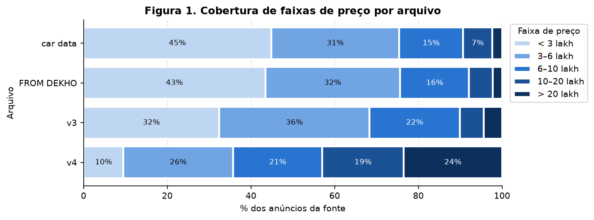
/// caption
**Figura 1.** Cobertura de faixas de preço por arquivo.
///

A Figura 1 é o argumento central da seleção. `car data`, `FROM DEKHO` e v3 cobrem a
**mesma faixa**: de 68% a 76% dos anúncios ficam abaixo de 6 lakh. O v4 é outra população:
**42,9% dos anúncios acima de 10 lakh, contra 10,1% no v3**. Com o v3 sozinho, um modelo
veria poucos carros caros e extrapolaria nessa faixa.

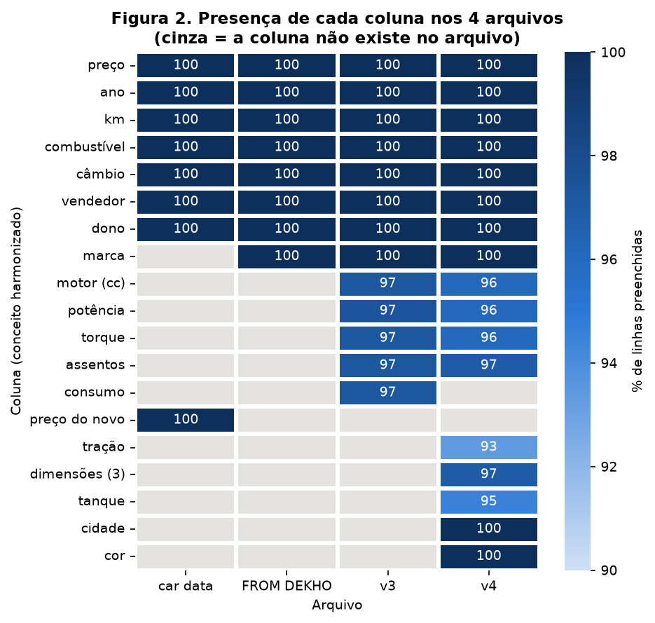
/// caption
**Figura 2.** Presença de cada coluna (conceito harmonizado) nos quatro arquivos.
///

``` { .python .copy .select linenums='1' title="docs/projects/eda/code/eda.py" }
--8<-- "docs/projects/eda/code/eda.py:presence"
```

Critérios aplicados, nesta ordem:

1. **Mínimo de 1000 linhas** (exigência do enunciado). `car data` tem 301 e sai. Ele traria
   ainda `Present_Price`, o preço do carro novo, que é praticamente o alvo com outro nome.
2. **A fonte precisa acrescentar algo e não pode conflitar com outra.** `FROM DEKHO` não
   tem nenhuma coluna que o v3 não tenha e cobre a mesma faixa de preço (Figura 1). Além
   disso, **321 carros aparecem nele e no v3 com o mesmo nome, ano e km, e só 59 com o
   mesmo preço**: empilhar os dois colocaria o mesmo carro com dois alvos diferentes no
   dataset. Sai.
3. **Uma coluna só fica se existir em todas as fontes escolhidas.** Com as quatro fontes,
   sobrariam 7 colunas, sem motor, potência ou torque, justamente o bloco técnico. Com
   **v3 + v4, sobram 12**. As colunas de um arquivo só caem: `mileage` (só v3) teria
   **20,2%** de ausência estrutural na união, e as 7 exclusivas do v4 (tração, três
   dimensões, tanque, cidade, cor) teriam **79,8%**. Imputar 80% de uma coluna seria
   inventar dado.

**Dataset escolhido: v3 + v4**, harmonizados nas 12 colunas comuns.

#### Harmonização

Cada arquivo é deduplicado **antes** da harmonização (ver 1B) e depois levado ao esquema
comum:

``` { .python .copy .select linenums='1' title="docs/projects/eda/code/cardekho.py" }
--8<-- "docs/projects/eda/code/cardekho.py:harmonize"
```

| Coluna final | v3 | v4 | Regra | Linhas afetadas |
|---|---|---|---|---|
| `brand` | 1ª palavra de `name` | `Make` | grafias unificadas | "Land" → "Land Rover" (6), "Ashok" → "Ashok Leyland" (1), "Maruti Suzuki" → "Maruti" (440) |
| `fuel` | 4 valores | 9 valores | misturas viram o combustível alternativo; elétrico e híbrido viram `Other` | "CNG + CNG", "Petrol + CNG" → CNG (2), "Petrol + LPG" → LPG (1), Electric/Hybrid → Other (10) |
| `owner` | 5 rótulos | 6 rótulos | ordinal 0–4 de donos anteriores | "Test Drive Car" (5) e "UnRegistered Car" (21) → 0; "Fourth & Above" (174), "Fourth" (3), "4 or More" (1) → 4 |
| `is_individual` | `seller_type` | `Seller Type` | só "Individual" existe nos dois: vira 0/1 | Dealer (1126), Trustmark Dealer (236), Corporate (57), Commercial Registration (5) → 0 |
| `engine_cc` | "1248 CC" | "1248 cc" | primeiro número | todas |
| `power_bhp` | "74 bhp" | "87 bhp @ 6000 rpm" ou "64@6200" | primeiro número; 0 bhp vira ausente | 6 linhas com "0" no v3 |
| `torque_nm` | "190Nm@ 2000rpm", "22.4 kgm at…" | "109 Nm @ 4500 rpm" ou "84@3500" | kgm × 9,80665, só abaixo de 100 | 482 convertidas; 23 marcadas "kgm" com o número já em Nm (ex.: "115@ 2,500(kgm@ rpm)" num Tata Sumo); 128 do v4 sem unidade lidas como Nm |
| `price`, `year`, `km`, `transmission`, `seats` | | | renomeadas | n/a |

/// caption
**Tabela 2.** Harmonização v3 + v4. As contagens são sobre os arquivos brutos.
///

Duas regras merecem justificativa. No v4, o número sem unidade em torque e potência está em
Nm e bhp: o Swift VDi aparece como "190@2000" e "75@4000", os mesmos valores que o v3 traz com
unidade. E 3 linhas do "Maruti Zen D" (58 bhp, 1527 cc) trazem **789 Nm**: a razão
torque/cilindrada de 0,52 Nm/cc é impossível num motor de rua, quando a maior razão real do
dataset é 0,33 (um Volvo XC90 híbrido). O valor vira ausente.

#### Dicionário final

**O que é uma linha:** um anúncio de carro usado no CarDekho, com as características do carro
e o preço pedido. Um carro pode ser anunciado mais de uma vez (ver 1B).

| Feature | Significado | Tipo | Unidade / faixa |
|---|---|---|---|
| `price` | **alvo**: preço pedido no anúncio | numérica contínua | ₹, 29.999 a 35.000.000 |
| `year` | ano de fabricação | numérica discreta | 1983 a 2022 |
| `km` | quilometragem | numérica contínua | km, 0 a 2.360.457 |
| `engine_cc` | cilindrada | numérica contínua (valores agrupados por família de motor) | cc, 624 a 6592 |
| `power_bhp` | potência máxima | numérica contínua | bhp, 32,8 a 660 |
| `torque_nm` | torque máximo | numérica contínua | Nm, 47 a 780 |
| `seats` | assentos | numérica discreta | 2 a 14 |
| `owner` | donos anteriores | **ordinal** (lida no arquivo como texto) | 0 a 4 (4 = quatro ou mais) |
| `is_individual` | vendedor é pessoa física | binária | 0/1 |
| `fuel` | combustível | categórica nominal | 5 valores |
| `transmission` | câmbio | categórica nominal | Manual / Automatic |
| `brand` | marca | categórica nominal, alta cardinalidade | 39 valores |
| `source` | arquivo de origem | categórica, **só para o EDA** | v3 / v4 |

/// caption
**Tabela 3.** Dicionário do dataset final: **8754 linhas** (6699 do v3, 2055 do v4),
**11 features** (8 numéricas, 3 categóricas) e o alvo.
///

`owner` é texto no arquivo bruto ("First Owner", "Second Owner"), mas a ordem tem significado,
por isso entra como ordinal e não como one-hot. `source` não é feature: um carro novo a ser
avaliado não tem "arquivo de origem". Ela serve para estratificar o split (1D) e para o teste
de mudança de distribuição em 3B.

### 1B. Qualidade

``` { .python .copy .select linenums='1' title="docs/projects/eda/code/eda.py" }
--8<-- "docs/projects/eda/code/eda.py:quality"
```

#### Valores ausentes

| Feature | Ausentes | % | % no v3 | % no v4 |
|---|---:|---:|---:|---:|
| `engine_cc` | 283 | 3,23% | 3,05% | 3,84% |
| `power_bhp` | 284 | 3,24% | 3,06% | 3,84% |
| `torque_nm` | 287 | 3,28% | 3,10% | 3,84% |
| `seats` | 267 | 3,05% | 3,05% | 3,07% |

/// caption
**Tabela 4.** Ausentes no dataset final. As outras 7 features e o alvo não têm ausentes.
///

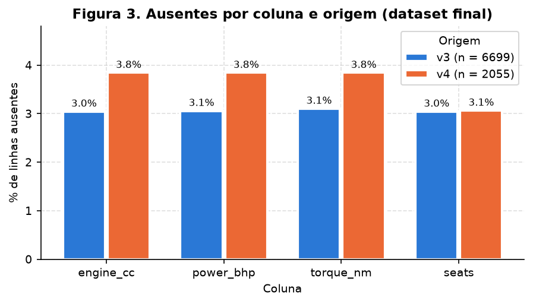
/// caption
**Figura 3.** Ausentes por coluna e origem.
///

A ausência é **um único evento, não quatro**: das 287 linhas com algum ausente (3,28%),
**267 não têm nenhuma das quatro colunas técnicas**. Outras 16 não têm motor, potência e
torque, 3 só o torque e 1 potência e torque. Os dois arquivos têm taxas parecidas
(Figura 3), então não é efeito de origem.

**E a ausência não é aleatória.** As 267 linhas sem ficha técnica têm **preço mediano de
210.000 ₹, contra 475.000 ₹ no dataset todo, e ano mediano 2009 contra 2015**. São carros
velhos e baratos, para os quais o site não tinha a ficha. Imputar a mediana sem mais nada
diria ao modelo que esses carros têm motor e potência típicos. Por isso o pipeline acrescenta
uma coluna 0/1 de ausência (4A).

#### Duplicatas

| Situação | Linhas | Tratamento |
|---|---:|---|
| v3, linhas idênticas | 1202 | removidas |
| v4, linhas idênticas | 0 | n/a |
| v3, iguais em tudo menos o preço | 440 (213 grupos) | colapsadas em 1 linha por grupo, preço mediano |
| v4, iguais em tudo menos o preço | 8 (4 grupos) | idem |
| v3 × v4, iguais nas colunas harmonizadas | 0 pares | n/a |

/// caption
**Tabela 5.** Duplicatas. Total removido: **1433 linhas** (10.187 → 8754).
///

Os 213 grupos do v3 têm o mesmo nome, ano, km, dono, consumo, motor, potência, torque e
assentos, e só o preço difere: **razão máximo/mínimo mediana de 1,107** (11%), máxima de 2,31.
É o mesmo carro anunciado de novo com desconto. Mantidas, as cópias poderiam cair uma no treino
e outra no teste, o que é vazamento: o modelo seria avaliado num carro que já viu.

A deduplicação roda **no arquivo bruto, antes de harmonizar**. Depois de descartar `name` e
`mileage`, 27 linhas ficam iguais a outra, mas são versões diferentes do mesmo modelo (por
exemplo "Maruti Alto 800 LXI Anniversary Edition" e "Maruti Alto 800 LXI Airbag", de 2013,
com 60.000 km e 190.000 ₹). Deduplicar nesse ponto apagaria carros distintos.

``` { .python .copy .select linenums='1' title="docs/projects/eda/code/cardekho.py" }
--8<-- "docs/projects/eda/code/cardekho.py:dedup"
```

#### Valores impossíveis e inconsistentes

| Achado | Linhas | Tratamento |
|---|---:|---|
| `power_bhp` = 0 | 6 | vira ausente (ausência disfarçada) |
| torque de 789 Nm num motor de 58 bhp | 3 | vira ausente (razão torque/cc > 0,4) |
| torque marcado "kgm" com o número já em Nm | 23 | não converte (regra < 100) |
| `km` = 0 num carro usado | 1 | corte por quantil no pipeline (4A) |
| `km` > 500.000 (máx. 2.360.457) | 5 | corte por quantil no pipeline (4A) |
| `year` > 2020 | 236 | mantidos: são reais, mas **só existem no v4** (risco na Síntese) |

/// caption
**Tabela 6.** Valores impossíveis ou inconsistentes.
///

#### Colunas descartadas

| Coluna | Motivo |
|---|---|
| `name` (v3) / `Model` (v4) | identificador: 2058 nomes distintos em 8128 linhas no v3. A marca é extraída antes |
| `mileage` | só existe no v3 (20,2% de ausência estrutural na união) |
| `Drivetrain`, `Length`, `Width`, `Height`, `Fuel Tank Capacity`, `Location`, `Color` | só existem no v4 (79,8%) |
| `source` | artefato da coleta, indisponível para um carro novo |

Nenhuma constante. **Vazamento:** nenhuma das 11 features é calculada a partir do preço. O
único vazamento direto do alvo no material era o `Present_Price` do `car data`, que ficou
fora. O vazamento indireto, o mesmo carro nos dois lados do split, foi contido pela
deduplicação acima.

### 1C. Alvo

``` { .python .copy .select linenums='1' title="docs/projects/eda/code/eda.py" }
--8<-- "docs/projects/eda/code/eda.py:target"
```

| Média | Mediana | Desvio padrão | Mín | Máx | Assimetria | Assimetria de log(preço) | Curtose |
|---:|---:|---:|---:|---:|---:|---:|---:|
| 796.193 ₹ | 475.000 ₹ | 1.353.854 ₹ | 29.999 ₹ | 35.000.000 ₹ | 8,39 | 0,43 | 121,3 |

/// caption
**Tabela 7.** Estatísticas do preço (dataset final).
///

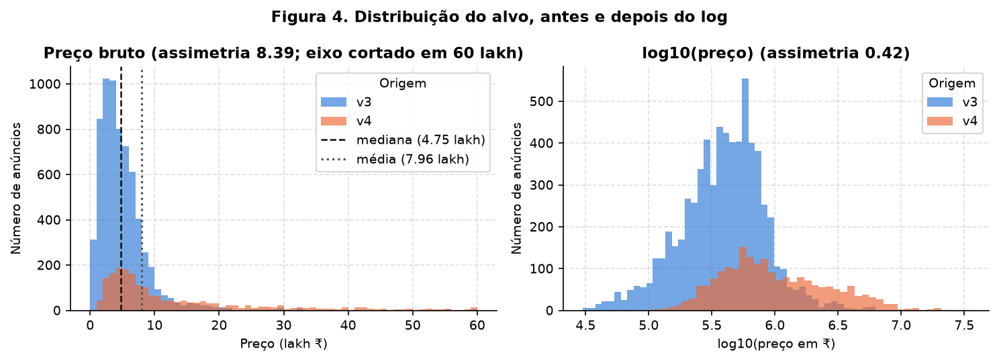
/// caption
**Figura 4.** Distribuição do alvo antes e depois do log.
///

O preço tem **assimetria 8,39**: a média (7,96 lakh) fica 68% acima da mediana (4,75 lakh),
puxada por 94 anúncios acima de 60 lakh, que nem cabem no eixo da esquerda. Em log, a
assimetria cai para **0,43**. Por isso o alvo será modelado como **log(preço)**. Sem isso, o
erro quadrático seria dominado pelas poucas Ferraris e Rolls-Royces, e um erro de 1 lakh
pesaria igual num carro de 2 lakh e num de 50.

A Figura 4 (direita) também mostra **os dois arquivos como duas populações**: o v4 está
deslocado para a direita (mediana de 825.000 ₹, contra 400.000 ₹ no v3 deduplicado). O
estudo dessa diferença está em 3B.

### 1D. Divisão treino/teste

``` { .python .copy .select linenums='1' title="docs/projects/eda/code/cardekho.py" }
--8<-- "docs/projects/eda/code/cardekho.py:split"
```

Divisão **80/20, `random_state=42`**, feita **logo depois da deduplicação e antes de
qualquer estatística aprendida**: mediana de imputação, quantis de corte, média e desvio da
padronização, categorias frequentes e PCA saem só do treino (4C prova isso). As figuras de 1–3
usam o dataset inteiro, porque o EDA pode olhar tudo. O que não pode é *aprender* um parâmetro
olhando o teste.

A estratificação combina **origem × quintil de log(preço)**:

- só por preço, a proporção v3/v4 poderia mudar entre os lados. Como os arquivos diferem em
  preço, câmbio e potência (3B), o teste deixaria de representar o treino;
- só por origem, as faixas de preço ficariam ao acaso.

Os quintis servem apenas para o sorteio e não entram no modelo. Não há split temporal: `year`
é o ano de fabricação, não a data do anúncio, e os dois arquivos não trazem data de coleta.

| | Treino | Teste |
|---|---:|---:|
| Linhas | **7003** | **1751** |
| Fração v3 / v4 | 0,7652 / 0,2348 | 0,7653 / 0,2347 |
| log(preço) médio | 13,0851 | 13,0877 |

/// caption
**Tabela 8.** Resultado do split.
///

Uma marca, **Peugeot** (1 anúncio), caiu só no teste: é o caso de categoria nunca vista que o
encoder precisa tratar (4A).

**Baseline:** prever sempre a mediana do treino (475.000 ₹) dá, no teste, **RMSE de 0,914 em
log(preço)** e **erro absoluto médio de 516.232 ₹**. As entregas seguintes precisam superar
esses números.

## 2. Análise univariada

### 2A. Features numéricas

``` { .python .copy .select linenums='1' title="docs/projects/eda/code/eda.py" }
--8<-- "docs/projects/eda/code/eda.py:describe"
```

| Feature | Média | Mediana | DP | Mín | Q1 | Q3 | Máx | Assimetria | Outliers (1,5·IQR) |
|---|---:|---:|---:|---:|---:|---:|---:|---:|---:|
| `year` | 2014,1 | 2015 | 4,14 | 1983 | 2012 | 2017 | 2022 | −0,94 | 213 |
| `km` | 69.513 | 60.000 | 59.129 | 0 | 35.000 | 90.000 | 2.360.457 | **13,43** | 258 |
| `engine_cc` | 1495,3 | 1353 | 544,6 | 624 | 1197 | 1598 | 6592 | 1,53 | 870 |
| `power_bhp` | 97,7 | 84,8 | 45,6 | 32,8 | 69,0 | 112,0 | 660 | **2,69** | 561 |
| `torque_nm` | 188,6 | 178 | 104,9 | 47,1 | 113 | 224 | 780 | 1,45 | 472 |
| `seats` | 5,41 | 5 | 0,95 | 2 | 5 | 5 | 14 | 1,87 | (1807) |
| `owner` | 1,45 | 1 | 0,71 | 0 | 1 | 2 | 4 | 1,55 | 172 |
| `is_individual` | 0,91 | 1 | 0,28 | 0 | 1 | 1 | 1 | −2,92 | n/a |

/// caption
**Tabela 9.** Estatísticas descritivas das numéricas (sem os ausentes da Tabela 4).
///

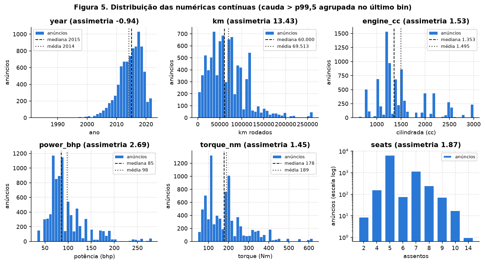
/// caption
**Figura 5.** Distribuição das numéricas contínuas.
///

O que a Figura 5 mostra, feature por feature:

- **`km`** tem a maior assimetria (13,43). A cauda é feita de 5 anúncios acima de 500 mil km,
  o máximo com 2,36 milhões, o que equivale a 59 voltas na Terra. Há também 7 anúncios
  abaixo de 1000 km, um deles com 0. As duas pontas são suspeitas.
- **`engine_cc` é multimodal**: picos em 796, ~1200, ~1500, ~2000 e ~2500 cc. Não é ruído,
  são as famílias de motor das montadoras. A cilindrada se comporta quase como categórica com
  ordem. Os 870 "outliers" pelo IQR são, em boa parte, esses motores grandes, perfeitamente
  reais.
- **`power_bhp` e `torque_nm`** têm cauda longa à direita (assimetria 2,69 e 1,45), formada
  pelos carros de luxo do v4.
- **`year`** tem assimetria negativa (−0,94): poucos carros antigos, cauda para a esquerda.
- **`seats`** tem Q1 = Q3 = 5 (78,7% dos carros têm 5 lugares). Com IQR zero, a regra do
  1,5·IQR marca como outlier **todo carro que não tem 5 lugares** (1807), o que é absurdo.
  Para uma discreta concentrada, a regra do IQR não se aplica.

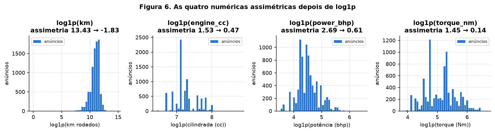
/// caption
**Figura 6.** As quatro numéricas assimétricas depois de `log1p`.
///

A Figura 6 justifica o log das quatro numéricas assimétricas no pipeline. A assimetria cai
de 1,53 para 0,47 em `engine_cc`, de 2,69 para 0,61 em `power_bhp` e de 1,45 para 0,14 em
`torque_nm`. Em `km`, o log troca a cauda direita por uma esquerda (−1,83), criada pelos 7
anúncios abaixo de 1000 km. Por isso o pipeline corta nos quantis **antes** do log (4A).

### 2B. Features categóricas

| Feature | Cardinalidade | Frequências |
|---|---:|---|
| `fuel` | 5 | Diesel 4681 (53,5%), Petrol 3913 (44,7%), CNG 106 (1,2%), LPG 44 (0,5%), Other 10 (0,1%) |
| `transmission` | 2 | Manual 7252 (82,8%), Automatic 1502 (17,2%) |
| `owner` | 5 | 1: 5706 (65,2%), 2: 2279 (26,0%), 3: 572 (6,5%), 4: 172 (2,0%), 0: 25 (0,3%) |
| `is_individual` | 2 | particular 7987 (91,2%), outros 767 (8,8%) |
| `brand` | **39** | Maruti 2502 (28,6%), Hyundai 1579 (18,0%), Mahindra 821 (9,4%), Tata 691 (7,9%), … |

/// caption
**Tabela 10.** Frequências das categóricas (`owner` e `is_individual` incluídas pela forma
de categorias, embora entrem no modelo como números).
///

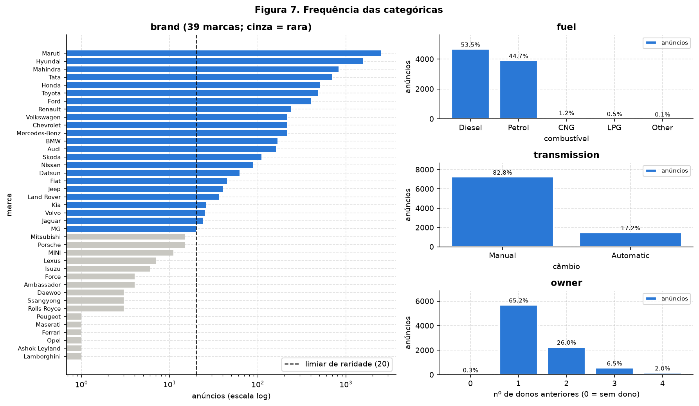
/// caption
**Figura 7.** Frequência das categóricas. À esquerda, as marcas raras (menos de 20 anúncios)
em cinza.
///

- **`brand` é a de alta cardinalidade**, com 39 marcas e distribuição muito concentrada: as
  três maiores somam 56,0% das linhas. **16 marcas têm menos de 20 anúncios**, somando 77
  linhas (0,88%), e 6 delas aparecem uma única vez. Um one-hot ingênuo criaria colunas que
  quase nunca valem 1, e o modelo não teria como aprender um coeficiente para elas.
- **A cardinalidade depende da origem.** 6 marcas existem só no v3 (Ambassador, Ashok
  Leyland, Daewoo, Force, Opel, Peugeot: as antigas e populares) e 7 só no v4 (Ferrari,
  Lamborghini, MINI, Maserati, Porsche, Rolls-Royce, Ssangyong: as de luxo). É a mesma
  diferença de população da Figura 1, vista pelas marcas.
- **`fuel`**: CNG, LPG e Other somam 1,8%. `Other` tem só 10 linhas (7 elétricos e 3
  híbridos), todas do v4.
- **`transmission`** é desbalanceada, com 82,8% manual.
- **`owner` = 0** tem só 25 linhas: 5 "Test Drive Car" do v3 e 20 "UnRegistered Car" do v4
  (dos 21 da Tabela 2, um saiu na deduplicação). 17 das 25 são Mercedes-Benz, Audi ou
  Porsche.

## 3. Análise bivariada e multivariada

### 3A. Numérica × numérica

``` { .python .copy .select linenums='1' title="docs/projects/eda/code/eda.py" }
--8<-- "docs/projects/eda/code/eda.py:corr"
```

**Método: Spearman.** As numéricas têm assimetrias de até 13,4 (Tabela 9) e o alvo de 8,4.
Pearson mede relação *linear* e é sensível à cauda; Spearman mede relação *monótona* sobre os
postos e não liga para a escala. A diferença aparece nos números: a correlação entre ano e
preço é **0,347 por Pearson e 0,704 por Spearman**. O preço sobe com o ano de forma
exponencial, não linear, e Pearson subestima a relação pela metade.

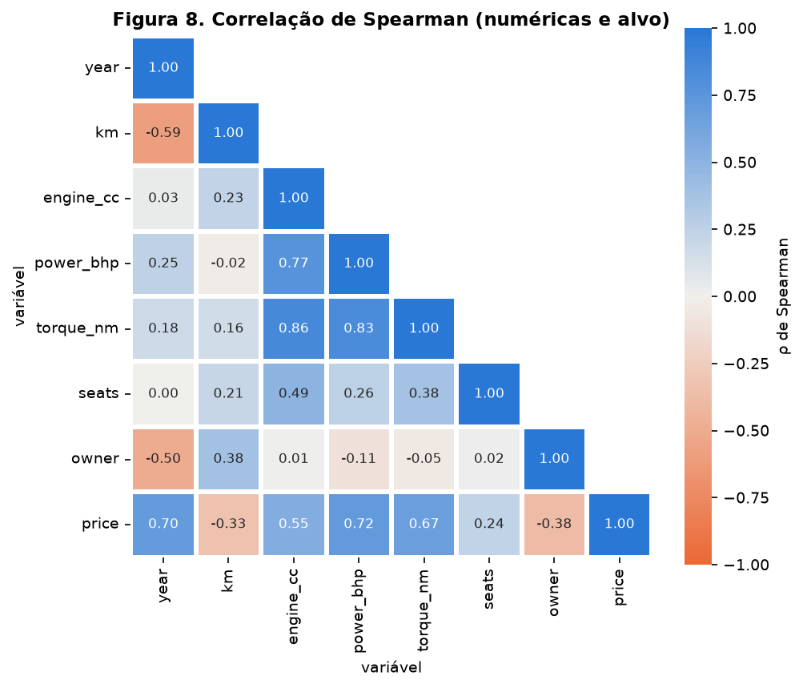
/// caption
**Figura 8.** Correlação de Spearman entre as numéricas e o alvo.
///

**Pares redundantes:** o bloco técnico.

| Par | ρ de Spearman |
|---|---:|
| `engine_cc` × `torque_nm` | **0,859** |
| `power_bhp` × `torque_nm` | **0,828** |
| `engine_cc` × `power_bhp` | **0,768** |
| `year` × `km` | −0,594 |
| `year` × `owner` | −0,501 |

/// caption
**Tabela 11.** Os cinco pares mais correlacionados (sem o alvo).
///

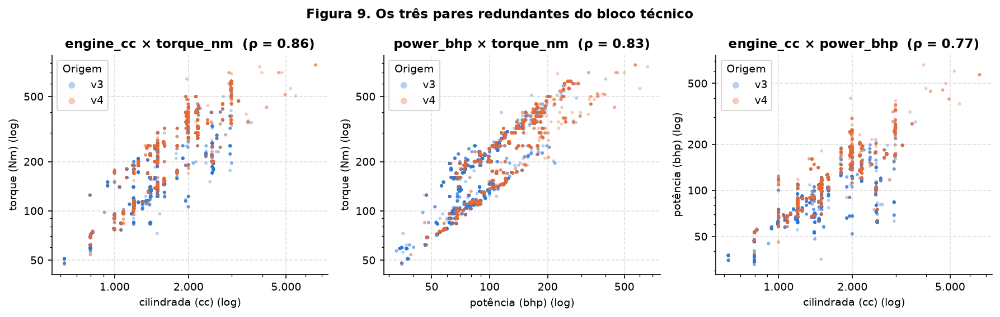
/// caption
**Figura 9.** Os três pares do bloco técnico, em escala log.
///

Motor, potência e torque medem quase a mesma coisa: **"o tamanho do motor"**. A Figura 9
mostra que a relação não é uma nuvem difusa: são faixas paralelas. Na potência × torque, por
exemplo, há duas faixas distintas, a de cima com os motores a diesel e a de baixo com os a
gasolina: a razão torque/potência mediana é **2,33 Nm/bhp no diesel e 1,37 na gasolina**. Os três pares não serão descartados agora: a
informação que um tem e os outros não (o tipo de motor) é útil, e uma rede neural lida com
colinearidade melhor que uma regressão linear. Mas o PCA vai concentrá-los numa só componente
(4B), e uma regressão linear precisaria de regularização.

O ano anda junto com km (−0,594) e com o número de donos (−0,501): carro velho rodou mais e
passou por mais mãos. É a segunda dimensão do dataset, "idade/uso", e reaparece em 4B.

**Checagem de Simpson: a correlação muda dentro dos grupos?** Sim, e numa feature importante.

| | ρ(`km`, `price`) |
|---|---:|
| todos os 8754 juntos | **−0,331** |
| dentro do mesmo ano (média ponderada, anos com ≥ 50 anúncios) | **+0,155** |
| faixa entre os anos | −0,078 a +0,278 |

/// caption
**Tabela 12.** O sinal da relação entre km e preço inverte quando se controla pelo ano.
///

No agregado, mais km significa carro mais barato. **Mas entre carros do mesmo ano, mais km
está associado a preço *mais alto*.** O ano é o confundidor: carros velhos rodaram mais *e*
valem menos, e isso produz a correlação negativa geral. Dentro de um mesmo ano, quem roda
muito é o diesel (3C: mediana de 77.000 km, contra 47.000 da gasolina), e o diesel é mais caro
(3B). A consequência para a modelagem é que **km não é um bom preditor isolado**: o efeito
dele só aparece corretamente com o ano no mesmo modelo.

Outras relações também mudam com o grupo, sem inverter o sinal. A correlação entre potência
e preço é 0,633 no v3 e 0,855 no v4. A entre cilindrada e preço é 0,456 nos manuais e 0,639
nos automáticos. A entre dono e preço é −0,396 no v3 e só −0,109 no v4.

### 3B. Categórica × alvo

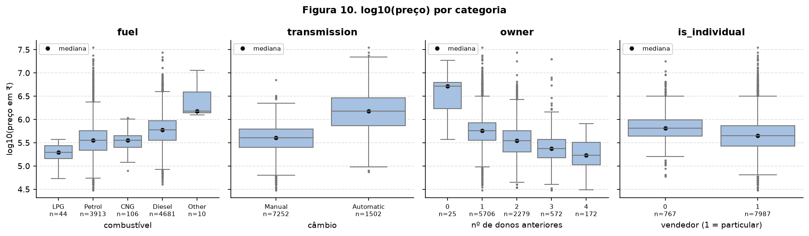
/// caption
**Figura 10.** log10(preço) por categoria, com o tamanho de cada grupo.
///

| Categoria | Preço mediano por grupo (₹) |
|---|---|
| `fuel` | LPG 197.500 · Petrol 360.000 · CNG 361.000 · Diesel 600.000 · Other 1.517.500 |
| `transmission` | Manual 402.000 · Automatic **1.500.000** |
| `owner` | 0: 5.200.000 · 1: 570.000 · 2: 350.000 · 3: 235.000 · 4: 170.000 |
| `is_individual` | outros 650.000 · particular 450.000 |

/// caption
**Tabela 13.** Preço mediano por categoria.
///

**Conclusões da Figura 10:**

- **Câmbio** é a categórica que mais separa: o automático tem mediana **3,7×** a do manual, e
  as caixas mal se sobrepõem.
- **Combustível:** o diesel custa 1,7× a gasolina. LPG é o mais barato e tem só 44 anúncios.
  `Other` (elétrico/híbrido) é caro, mas com 10 linhas é estatisticamente frágil, o que
  justifica agrupá-lo como infrequente (4A).
- **Donos:** o preço cai de forma **monótona** de 1 para 4 donos anteriores. Isso justifica
  manter `owner` como ordinal numérica em vez de one-hot. O grupo 0 (5,2 milhões ₹) não
  mostra que "carro sem uso valoriza": 17 das 25 linhas são Mercedes-Benz, Audi ou Porsche
  (2B). Com 25 linhas, é um grupo pequeno e de composição atípica.
- **Vendedor:** lojas e empresas pedem mais (mediana 650 mil contra 450 mil), mas a
  sobreposição é grande. É o efeito mais fraco dos quatro.

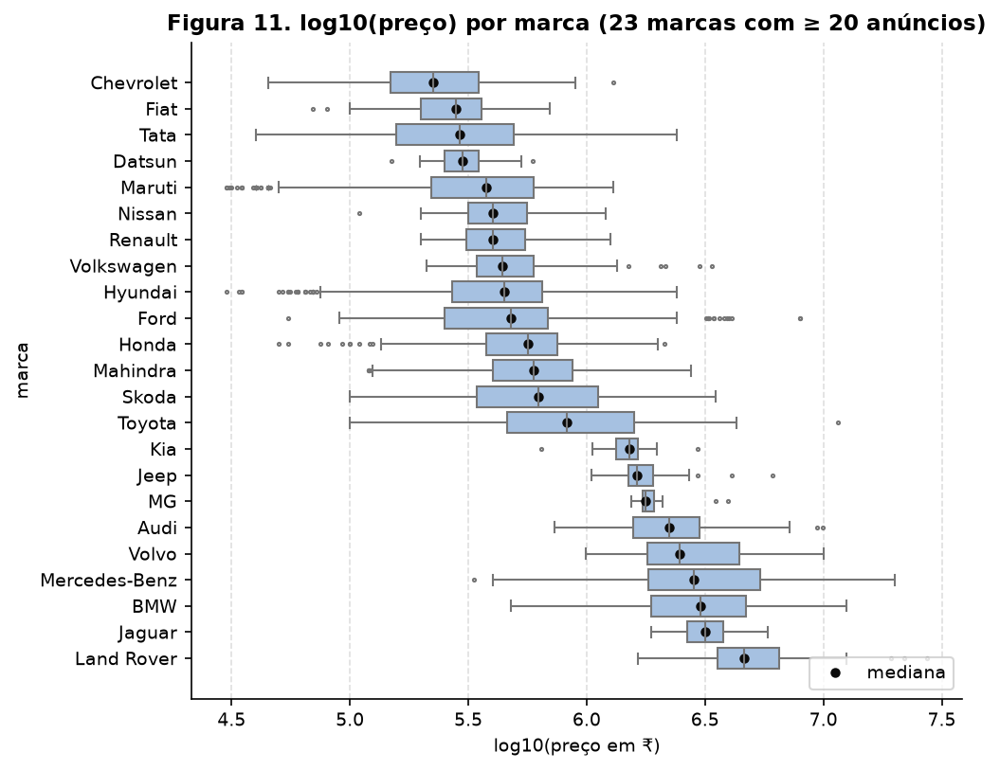
/// caption
**Figura 11.** log10(preço) por marca (marcas com 20 ou mais anúncios).
///

**Conclusão da Figura 11:** a marca separa o preço em uma ordem de grandeza. A mediana vai de
**225.000 ₹ (Chevrolet) a 4.637.500 ₹ (Land Rover), 20,6×**. As marcas formam patamares:
as populares (Chevrolet 2,2, Fiat 2,8, Tata 2,9, Datsun 3,0, Maruti 3,8 lakh) abaixo de
5 lakh, um degrau intermediário (Kia, Jeep, MG, de 15 a 18 lakh) e as de luxo (Audi, Volvo,
Mercedes-Benz, BMW, Jaguar, Land Rover) acima de 20 lakh. `brand` é, provavelmente, a feature categórica mais informativa. A alta
cardinalidade não pode ser resolvida descartando a marca.

**A origem continua importando quando se comparam carros parecidos?**

``` { .python .copy .select linenums='1' title="docs/projects/eda/code/eda.py" }
--8<-- "docs/projects/eda/code/eda.py:source_effect"
```

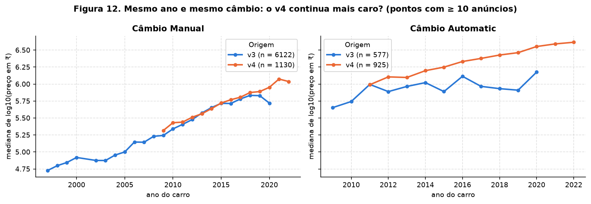
/// caption
**Figura 12.** Mediana do preço por ano, separando câmbio e origem.
///

| Comparação | Diferença v4 − v3 em log10(preço) | Em razão |
|---|---:|---:|
| bruta (todos os anúncios) | 0,314 | **2,06×** |
| pareada por marca × faixa de ano × câmbio | 0,045 | **1,11×** |

/// caption
**Tabela 14.** Efeito da origem antes e depois de comparar carros parecidos (85 células com
pelo menos 3 anúncios de cada origem, cobrindo 7631 anúncios).
///

**Conclusão da Figura 12:** a maior parte da diferença entre os arquivos é **composição**, e
não preço. No câmbio manual, as duas curvas praticamente se sobrepõem ano a ano. A diferença
fica no automático, onde o v4 tem mais carros de luxo (3C: potência mediana de 174 bhp, contra
126 no v3). Comparando dentro de mesma marca, faixa de ano e câmbio, o v4 é só 11% mais caro,
e é mais caro em 65% das células. Esse resíduo é compatível com uma coleta mais recente, com
preços maiores no período. Para a modelagem, isso significa que **as features explicam a
diferença entre as fontes**. Empilhar os arquivos não cria dois mercados incompatíveis, e
`source` pode ficar fora do modelo.

### 3C. Numérica × categórica

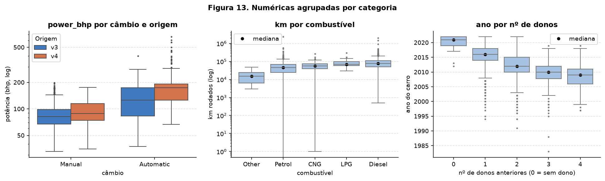
/// caption
**Figura 13.** Numéricas agrupadas por categoria.
///

| Relação | Posição (mediana) | Dispersão (IQR) |
|---|---|---|
| `power_bhp` por câmbio | Automatic 160,8 · Manual 81,9 bhp | 79,5 · 31,0 |
| `km` por combustível | Diesel 77.000 · LPG 70.000 · CNG 57.500 · Petrol 47.000 · Other 15.000 | 60.000 · 40.000 · 36.673 · 45.000 · 18.500 |
| `year` por dono | 0: 2021 · 1: 2016 · 2: 2012 · 3: 2010 · 4: 2009 | 3,0 · 4,0 · 5,0 · 4,2 · 5,0 |

/// caption
**Tabela 15.** Posição e dispersão por grupo.
///

**Leitura por posição e dispersão:**

- **Potência × câmbio (esquerda):** o automático tem o dobro da potência mediana e **2,6× a
  dispersão**. O manual é um grupo homogêneo de carros populares. O automático mistura
  carros médios e superesportivos. A separação por origem dentro do automático (126 bhp no
  v3, 174 no v4) é o mecanismo do efeito da Figura 12.
- **km × combustível (centro):** o diesel roda mais (mediana 77.000 km) e com a maior
  dispersão. É o elo que explica o paradoxo de Simpson de 3A: o carro que roda muito é o
  diesel, que vale mais. Os elétricos e híbridos (`Other`) têm a menor quilometragem, porque
  são os mais novos.
- **Ano × dono (direita):** cada dono a mais corresponde, em mediana, a 2 a 4 anos a menos
  (2016 → 2012 → 2010 → 2009), com dispersão estável de 4 a 5 anos. `owner` e `year` medem em
  parte a mesma coisa (ρ = −0,501, 3A), mas a dispersão mostra que não são substitutos: há
  carros de 2015 com 3 donos e de 2010 com 1.

## 4. Pré-processamento

### 4A. Estratégias

<!-- Âncora usada pelos templates de Classificação/Regressão ("plano de pré-processamento"). -->
<a id="8-plano-de-pre-processamento"></a>

Cada escolha aponta para o achado que a motiva:

| # | Problema | Achado | Estratégia (ajustada só no treino) |
|---|---|---|---|
| 1 | **Ausentes** | 3,3% das linhas, quase todas sem as 4 colunas técnicas ao mesmo tempo; não aleatório (preço mediano 210 mil contra 475 mil, 1B) | numéricas: **mediana do treino** + **coluna indicadora de ausência** (`MissingIndicator`), para o modelo ainda saber que a ficha faltava. Categóricas: moda (hoje sem ausentes; é defensivo) |
| 2 | **Outliers** | `km` com 2,36 milhões e 0 km; caudas de potência, torque e cilindrada (assimetria até 13,4, Tabela 9) | **corte nos quantis 0,5% e 99,5% do treino** (`QuantileClipper`) nas 4 assimétricas, seguido de `log1p` (Figura 6). Afeta **204 linhas do treino (2,91%)** |
| 3 | **Encoding** | `brand` com 39 marcas, 16 abaixo de 20 anúncios; Peugeot só no teste (1D); `owner` monótona com o preço (Figura 10) | **one-hot** com `min_frequency=20` e `handle_unknown="infrequent_if_exist"`: marcas raras e categorias **nunca vistas** caem numa coluna "infrequente". `owner` como **ordinal** numérica, `is_individual` como 0/1 |
| 4 | **Escala** | escalas de 0/1 (`is_individual`) a 10⁶ (`km`) (Tabela 9) | **`StandardScaler`** em todas as numéricas, depois do log nas 4 assimétricas. A rede neural precisa de entradas centradas e com variância comparável, senão a feature de maior escala domina o gradiente e satura as ativações |
| 5 | **Alvo** | assimetria 8,39 → 0,43 em log (1C) | modelar **log(preço)**. Fora do `ColumnTransformer`: entra no modelo da próxima entrega |

/// caption
**Tabela 16.** Estratégias de pré-processamento.
///

Por que **cortar** e não **remover** outliers: as caudas misturam valores impossíveis (2,36
milhões de km) com valores reais e raros (a Ferrari de 660 bhp e 35 milhões ₹). Remover a linha
descartaria o preço de um carro real. O corte mantém a linha e limita a influência do valor
extremo. Os limites aprendidos no treino foram:

- `km` de 2.389 a 260.000;
- `engine_cc` de 796 a 2996;
- `power_bhp` de 35,5 a 279,9;
- `torque_nm` de 59 a 600.

As linhas afetadas por coluna foram 71 em `km`, 58 em `engine_cc`, 72 em `power_bhp` e 56 em
`torque_nm`.

### 4B. Redução de dimensionalidade

As três projeções usam as **features já transformadas do treino** (`Z_train`, 37 colunas),
coloridas por log10(preço). O alvo não entra na projeção, serve só para colorir.

**PCA:**

``` { .python .copy .select linenums='1' title="docs/projects/eda/code/eda.py" }
--8<-- "docs/projects/eda/code/eda.py:pca"
```

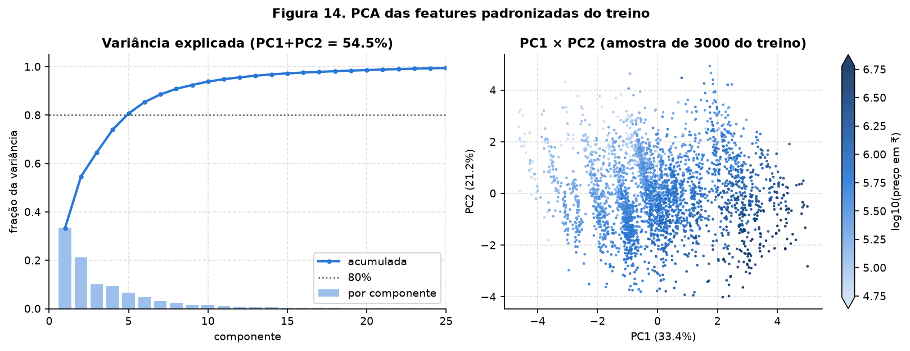
/// caption
**Figura 14.** PCA: variância explicada e projeção PC1 × PC2.
///

| Componente | 1 | 2 | 3 | 4 | 5 | 6 | 7 | 8 |
|---|---:|---:|---:|---:|---:|---:|---:|---:|
| Fração | 0,3335 | 0,2120 | 0,1007 | 0,0933 | 0,0669 | 0,0469 | 0,0318 | 0,0234 |
| Acumulada | 0,3335 | **0,5455** | 0,6462 | 0,7395 | **0,8064** | 0,8533 | 0,8851 | **0,9084** |

/// caption
**Tabela 17.** Variância explicada pelas oito primeiras componentes.
///

**PC1 + PC2 retêm 54,55%** da variância. São precisas 5 componentes para 80% e 8 para 90%.
Três componentes têm variância zero: são as três dependências lineares do one-hot (em
`fuel`, `transmission` e `brand`, as colunas de cada bloco somam 1). Ou seja, 37 colunas, 34
direções reais.

**Loadings:**

- **PC1**: `torque_nm` 0,528, `engine_cc` 0,518, `power_bhp` 0,490, `seats` 0,285, diesel
  0,174, gasolina −0,164. A PC1 é o **"tamanho do carro"**: os três redundantes de 3A
  entram juntos e com pesos quase iguais, como previsto.
- **PC2**: `km` 0,567, `year` −0,552, `owner` 0,489. A PC2 é a **"idade/uso"**, o segundo
  bloco de 3A.

As duas componentes estão ligadas ao preço: a correlação com log(preço) é **0,741 na PC1 e
−0,510 na PC2**. Na Figura 14, o preço cresce da esquerda para a direita (carros maiores) e
de cima para baixo (carros mais novos). O dataset tem duas dimensões principais, e as duas
importam para a tarefa.

**t-SNE e UMAP** rodam numa amostra de 3000 linhas do treino (sorteada com o `RNG` de
semente 42), com dois valores do parâmetro de vizinhança cada:

``` { .python .copy .select linenums='1' title="docs/projects/eda/code/eda.py" }
--8<-- "docs/projects/eda/code/eda.py:nonlinear"
```

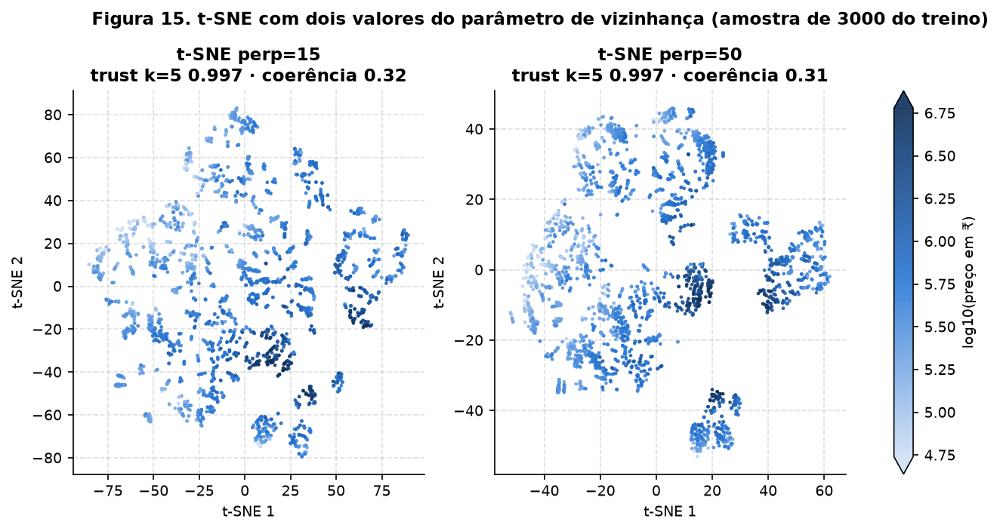
/// caption
**Figura 15.** t-SNE com perplexidade 15 e 50.
///

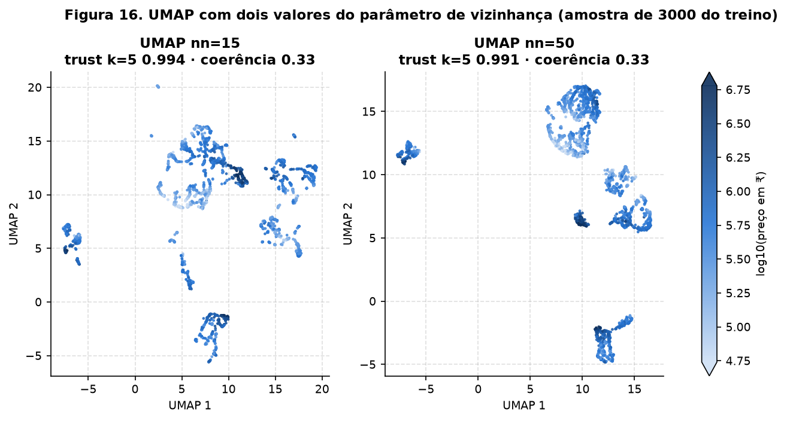
/// caption
**Figura 16.** UMAP com n_neighbors 15 e 50.
///

Para comparar os mapas com o mesmo critério, usamos duas medidas:

- **trustworthiness** com k = 5 (vizinhança local) e k = 30 (mais ampla): os vizinhos no mapa
  eram vizinhos nos dados?
- **coerência de preço**: o desvio do log(preço) entre os 10 vizinhos de cada ponto no mapa,
  dividido pelo desvio global. Vale 1 se a vizinhança é tão variada quanto o dataset inteiro
  e 0 se os vizinhos têm todos o mesmo preço. Só usa vizinhos mais próximos, nenhum modelo é
  ajustado.

``` { .python .copy .select linenums='1' title="docs/projects/eda/code/eda.py" }
--8<-- "docs/projects/eda/code/eda.py:sample"
```

| Mapa | Trust k = 5 | Trust k = 30 | Coerência de preço |
|---|---:|---:|---:|
| PCA | 0,887 | 0,882 | 0,345 |
| t-SNE, perplexidade 15 | **0,997** | 0,978 | 0,321 |
| t-SNE, perplexidade 50 | **0,997** | **0,987** | **0,311** |
| UMAP, n_neighbors 15 | 0,994 | 0,979 | 0,334 |
| UMAP, n_neighbors 50 | 0,991 | 0,982 | 0,326 |
| *espaço original, 37 dimensões* | n/a | n/a | *0,304* |
| *controle: colunas embaralhadas, t-SNE 50* | n/a | n/a | ***0,916*** |

/// caption
**Tabela 18.** Os cinco mapas com os mesmos critérios, mais a referência e o controle.
///

**O controle.** Antes de interpretar os grupos dos mapas não lineares, rodamos o t-SNE sobre
as mesmas colunas **embaralhadas uma a uma**: as distribuições ficam idênticas, mas as
relações entre colunas são destruídas.

``` { .python .copy .select linenums='1' title="docs/projects/eda/code/eda.py" }
--8<-- "docs/projects/eda/code/eda.py:control"
```

O t-SNE também desenha grupos limpos nesse ruído, mas a coerência de preço vai a **0,916**,
contra 0,31 nos dados reais. A organização por preço que aparece nas Figuras 15 e 16 é dos
dados, não do algoritmo.

**O que as projeções não lineares mostram e o PCA não mostra:**

- **Grupos discretos.** O PCA mostra uma nuvem contínua (Figura 14). t-SNE e UMAP a quebram
  em **ilhas separadas**, que são as combinações de câmbio e combustível. No UMAP com
  n_neighbors 50, **95,9% dos 10 vizinhos de cada ponto têm o mesmo combustível** (o acaso
  daria 48,6%), **89,5% têm o mesmo câmbio e combustível** (acaso: 35,1%) e 69,4% a mesma
  marca (acaso: 14,1%). Como o one-hot cria coordenadas 0/1, carros do mesmo grupo ficam a uma
  distância fixa dos demais, e os métodos de vizinhança os isolam. Dentro de cada ilha, o preço
  varia gradualmente (gradiente de cor). O PCA, sendo linear, mostra essas ilhas sobrepostas
  em dois eixos.
- **Os carros mais caros ficam juntos.** Nas Figuras 15 e 16, os pontos escuros ocupam ilhas
  pequenas e compactas. **84,0% dos 10% mais caros da amostra são automáticos**, contra 16,4%
  na amostra toda. A ilha cara é a do câmbio automático, coerente com a Figura 10.
- **Preservação local.** A trustworthiness local é 0,991–0,997 nos não lineares, contra
  0,887 no PCA. Na escala mais ampla (k = 30), a vantagem diminui. Isso é coerente com o que
  cada método otimiza: o PCA preserva a variância global, t-SNE e UMAP preservam vizinhança.
- **A coerência de preço é parecida em todos (0,31–0,35) e próxima à do espaço original
  (0,304).** Os métodos não lineares não "descobrem" uma relação com o preço que as 37
  dimensões não tenham. Só a mostram melhor em 2D.
- **O parâmetro muda a aparência, não a conclusão.** Perplexidade 15 fragmenta mais e 50
  agrupa mais. As medidas mudam na terceira casa decimal. O que é estável nos quatro mapas é o
  que se pode interpretar: ilhas por marca, câmbio e combustível, com o preço como gradiente
  dentro delas.
- **Uso prático.** Só o PCA e o UMAP têm `.transform()` para projetar dados novos. O t-SNE
  otimiza posições, não aprende uma função, e serve só para exploração.

### 4C. Pipeline

``` { .python .copy .select linenums='1' title="docs/projects/eda/code/cardekho.py" }
--8<-- "docs/projects/eda/code/cardekho.py:preprocess"
```

O pipeline é importável de `code/`, e é assim que o script e as entregas seguintes o usam:

``` { .python .copy .select linenums='1' title="docs/projects/eda/code/eda.py" }
--8<-- "docs/projects/eda/code/eda.py:pipeline"
```

| Verificação | Treino | Teste |
|---|---:|---:|
| Shape | **(7003, 37)** | **(1751, 37)** |
| NaN restantes | **0** | **0** |
| Linhas com indicador de ausência = 1 | 214 | 69 |

/// caption
**Tabela 19.** Saída do pipeline.
///

**Features finais (37):** são produzidas na ordem abaixo.

- `missingindicator_engine_cc`;
- `km`, `engine_cc`, `power_bhp` e `torque_nm` (log), mais `year`, `seats`, `owner` e
  `is_individual` (padronizadas);
- 5 colunas de `fuel`: CNG, Diesel, LPG, Petrol e *infrequent* (Other);
- 2 colunas de `transmission`;
- 21 colunas de `brand`: 20 marcas com ≥ 20 anúncios no treino (Audi, BMW, Chevrolet, Datsun,
  Fiat, Ford, Honda, Hyundai, Jeep, Land Rover, Mahindra, Maruti, Mercedes-Benz, Nissan,
  Renault, Skoda, Tata, Toyota, Volkswagen, Volvo) e *infrequent*, que agrupa as 18 restantes
  e as marcas nunca vistas.

**Prova de que o teste não vazou para o pré-processamento:**

- **A média das contínuas é zero no treino** (máximo |média| = 2,2 × 10⁻¹⁵) **e não no
  teste**: [0,003, 0,004, 0,001, 0,008, −0,025, −0,012]. Se o teste também desse exatamente
  zero, a padronização teria visto o teste.
- **As medianas de imputação são as do treino**: `engine_cc` 1364 e `torque_nm` 175, contra
  1353 e 178 no dataset inteiro. A diferença é pequena, e é por ser pequena que o erro de
  ajustar na base toda passaria despercebido.

## 5. Síntese

**Principais achados:**

1. **Os dois arquivos são duas populações** (Figura 1, Tabela 1): o v4 tem 43% dos anúncios
   acima de 10 lakh, contra 10% no v3. Combiná-los amplia a faixa de preço coberta. A
   diferença entre eles é quase toda de composição (2,06× bruto, 1,11× pareado; Figura 12),
   então as features a explicam.
2. **O alvo é muito assimétrico** (8,39 → 0,43 em log; Figura 4) e será modelado em log.
3. **Motor, potência e torque são redundantes** (ρ de 0,77 a 0,86; Figuras 8 e 9) e formam a
   PC1. Ano, km e donos formam a PC2 (Figura 14). As duas componentes se correlacionam com o
   preço.
4. **km tem um paradoxo de Simpson** (Tabela 12): ρ = −0,33 no geral e +0,16 dentro do mesmo
   ano, mediado pelo diesel (Figura 13).
5. **Marca e câmbio são as categóricas mais fortes** (20,6× e 3,7× entre medianas; Figuras 10
   e 11).
6. **A ausência carrega informação** (1B): os carros sem ficha técnica são mais velhos e
   baratos.

**Riscos para a modelagem e plano:**

| Risco | Evidência | Plano |
|---|---|---|
| Mesmo carro no treino e no teste | 213 grupos reanunciados (1B) | colapsados antes do split; manter `load_dataset()` como única porta de entrada |
| Extrapolação para carros caros e recentes | > 20 lakh e `year` > 2020 quase só no v4 (Figura 1, Tabela 6) | avaliar o erro **por faixa de preço e por origem**, além do global |
| Marcas raras com coeficiente instável | 16 marcas < 20 anúncios (Figura 7) | grupo *infrequent*; testar um embedding de marca se o erro por marca ficar alto |
| Colinearidade no bloco técnico | ρ até 0,86 (Tabela 11) | regularização (L2/dropout) na rede; não interpretar pesos individuais |
| Efeito de km mal especificado | Simpson (Tabela 12) | sempre `year` e `km` juntos; checar resíduos por ano |
| Erro em rúpias dominado pelos caros | assimetria 8,39 | treinar em log; reportar também o erro relativo |
| Grupo `owner` = 0 atípico | 25 linhas, 21 de luxo do v4 (Figura 10) | monitorar o resíduo desse grupo |

### Results summary

| # | Resumo dos resultados | Valor |
|---|---|---|
| 1 | Dataset, tarefa, alvo | CarDekho v3 + v4 (Kaggle); regressão; `price` (₹), modelado como log(preço) |
| 2 | Instâncias × features (numéricas/categóricas) | 8754 × 11 (8 numéricas / 3 categóricas) |
| 3 | Coluna com mais ausentes e % | `torque_nm`, 3,28% |
| 4 | Colunas descartadas e motivo | `name`/`Model` (identificador); `mileage` e 7 colunas só do v4 (ausência estrutural de 20% e 80%); `source` (artefato da coleta). Arquivos `car data` (< 1000 linhas) e `FROM DEKHO` (sem colunas novas, preços conflitantes) |
| 5 | Classe minoritária (%) ou média/mediana do alvo | média 796.193 ₹, mediana 475.000 ₹ |
| 6 | Tamanho de treino e teste | 7003 / 1751 |
| 7 | Par numérico mais correlacionado e valor | `engine_cc` × `torque_nm`, ρ de Spearman = 0,859 |
| 8 | Linhas afetadas pela estratégia de outliers | 204 linhas do treino (2,91%) cortadas nos quantis 0,5%/99,5% |
| 9 | Variância explicada por PC1 + PC2 | 54,55% |
| 10 | Shape após o pipeline | treino (7003, 37), teste (1751, 37) |

## Referências

- Birla, N. *Vehicle dataset (CarDekho)*. Kaggle.
  <https://www.kaggle.com/datasets/nehalbirla/vehicle-dataset-from-cardekho>
- scikit-learn: [`ColumnTransformer`](https://scikit-learn.org/stable/modules/generated/sklearn.compose.ColumnTransformer.html),
  [`OneHotEncoder`](https://scikit-learn.org/stable/modules/generated/sklearn.preprocessing.OneHotEncoder.html)
  (`min_frequency`, `handle_unknown="infrequent_if_exist"`),
  [`MissingIndicator`](https://scikit-learn.org/stable/modules/generated/sklearn.impute.MissingIndicator.html),
  [`trustworthiness`](https://scikit-learn.org/stable/modules/generated/sklearn.manifold.trustworthiness.html).
- McInnes, L., Healy, J., Melville, J. *UMAP: Uniform Manifold Approximation and Projection
  for Dimension Reduction*, 2018.
- van der Maaten, L., Hinton, G. *Visualizing Data using t-SNE*. JMLR, 2008.
